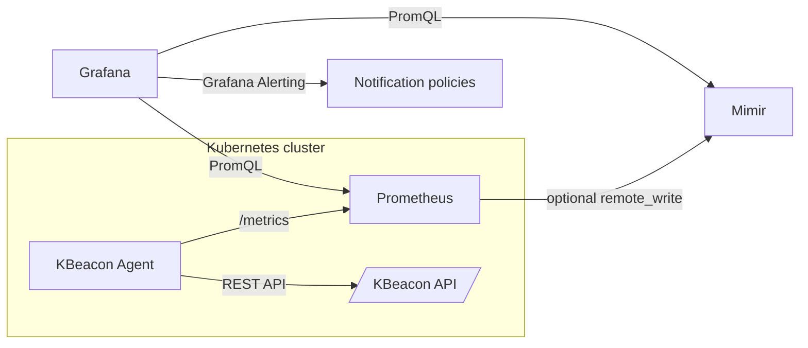

# KBeacon

[](https://github.com/memoliyasti/kbeacon/actions/workflows/ci.yaml)
[](https://github.com/memoliyasti/kbeacon/actions/workflows/release.yaml)
[](https://github.com/memoliyasti/kbeacon/actions/workflows/pages.yaml)
[](LICENSE)

**KBeacon** is a Kubernetes-native Secret Dependency Intelligence platform.

It answers one operational question clearly:

> **If this Secret changes, what workloads are affected?**

KBeacon is intentionally lightweight. It does not introduce a monitoring platform, graph database, message bus, custom UI, CRDs, admission webhooks, or an operator. Each Kubernetes cluster runs one KBeacon Agent. Existing Prometheus scrapes the Agent. Prometheus can remote-write to Grafana Mimir. Grafana remains the user interface for dashboards and alerting.



## Community and governance

- Documentation site: https://memoliyasti.github.io/kbeacon/
- Contributing guide: [`CONTRIBUTING.md`](CONTRIBUTING.md)
- Code of Conduct: [`CODE_OF_CONDUCT.md`](CODE_OF_CONDUCT.md)
- Security policy: [`SECURITY.md`](SECURITY.md)
- Governance: [`GOVERNANCE.md`](GOVERNANCE.md)
- Maintainers: [`MAINTAINERS.md`](MAINTAINERS.md)
- Release process: [`RELEASE.md`](RELEASE.md)

## Current implementation status

KBeacon includes a working Go Agent and Helm chart.

Implemented today:

- Kubernetes `client-go` configuration with in-cluster config and local kubeconfig fallback.
- Shared informer based discovery.
- Informers for Secret, Pod, Deployment, StatefulSet, DaemonSet, Job, and CronJob.
- Dependency extraction from:
  - `env.valueFrom.secretKeyRef`
  - `envFrom.secretRef`
  - `volumes.secret`
  - `imagePullSecrets`
  - `kbeacon.io/watch-secrets`
  - `kbeacon.io/watch-secrets-json`
- Config-driven namespace include/exclude filtering.
- Config-driven resource watcher enablement.
- In-memory Secret dependency graph cache.
- REST API backed by the graph cache.
- Prometheus collectors for dependency and runtime metrics.
- Grafana dashboards.
- Prometheus alerting and recording rule examples.
- Helm deployment.
- Local Minikube in-cluster workflow.
- GitHub Actions CI and GHCR release workflow.

Planned / future:

- Strimzi `KafkaConnector` discovery.
- Confluent `Connector` discovery.
- `ReplicaSet` owner-resolution improvements.
- ExternalSecret and SecretProviderClass support.
- Grafana App Plugin.
- OpenTelemetry export path.
- Optional operator mode.

## Core principles

1. **Grafana is the UI.** KBeacon ships dashboards and may later ship a Grafana App Plugin, but it does not run a custom web UI.
2. **Prometheus/Mimir are the storage.** KBeacon exposes metrics and a read-only HTTP API; it does not persist dependency history in a local database.
3. **KBeacon is the discovery engine.** It watches Kubernetes resources, calculates dependencies and impact, then exposes the current state.
4. **No Secret values are exported.** KBeacon never emits Secret data values through metrics, logs, or APIs.
5. **No platform sprawl.** No Kafka, no correlator service, no graph database, no CRDs, no admission webhooks, no AI subsystem.

## Quickstart: Minikube in-cluster mode

This is the recommended local development workflow because it exercises the real Helm chart, RBAC, Kubernetes informers, Prometheus scrape path, and Grafana dashboards.

### Prerequisites

```bash
minikube start
kubectl config current-context
helm version
docker version
jq --version
```

Install Prometheus and Grafana first. The local development helper files assume Prometheus is installed in `kube-addons` and Grafana has a Prometheus datasource.

### Create demo workload

```bash
kubectl create namespace kbeacon-demo --dry-run=client -o yaml | kubectl apply -f -

cat > /tmp/kbeacon-demo-secret.yaml <<'YAML'
apiVersion: v1
kind: Secret
metadata:
  name: app-db-secret
  namespace: kbeacon-demo
type: Opaque
stringData:
  username: demo
  password: demo
YAML

kubectl apply -f /tmp/kbeacon-demo-secret.yaml
```

```bash
cat > /tmp/kbeacon-demo-deployment.yaml <<'EOF'
apiVersion: apps/v1
kind: Deployment
metadata:
  name: api
  namespace: kbeacon-demo
  annotations:
    kbeacon.io/enabled: "true"
    kbeacon.io/discovery-mode: "hybrid"
    kbeacon.io/owner-team: "platform"
    kbeacon.io/criticality: "high"
spec:
  replicas: 1
  selector:
    matchLabels:
      app: api
  template:
    metadata:
      labels:
        app: api
    spec:
      containers:
        - name: api
          image: busybox:1.36
          command: ["sh", "-c", "sleep 3600"]
          env:
            - name: DB_USERNAME
              valueFrom:
                secretKeyRef:
                  name: app-db-secret
                  key: username
            - name: DB_PASSWORD
              valueFrom:
                secretKeyRef:
                  name: app-db-secret
                  key: password
          envFrom:
            - secretRef:
                name: app-db-secret
          volumeMounts:
            - name: db-secret
              mountPath: /var/run/secrets/db
              readOnly: true
      volumes:
        - name: db-secret
          secret:
            secretName: app-db-secret
EOF

kubectl apply -f /tmp/kbeacon-demo-deployment.yaml
```

### Build and deploy KBeacon into Minikube

```bash
./hack/local-dev/deploy-incluster-minikube.sh
```

This script:

- switches Docker to the Minikube Docker daemon;
- builds `kbeacon-agent:dev`;
- installs the Helm chart into `kbeacon-system`;
- waits for `Deployment/kbeacon` rollout.

### Configure Prometheus to scrape KBeacon

```bash
./hack/local-dev/configure-prometheus-incluster.sh
```

Make sure Prometheus is reachable locally:

```bash
kubectl -n kube-addons port-forward svc/prometheus-server 9090:80
```

### Smoke test

```bash
./hack/local-dev/smoke-incluster.sh
```

Expected results:

```text
up{job="kbeacon-agent"} == 1
kbeacon_cluster_dependency_count{job="kbeacon-agent"} == 1
kbeacon_secret_impact_score{namespace="kbeacon-demo",secret_name="app-db-secret"} == 24
```

### Test the REST API

```bash
kubectl -n kbeacon-system port-forward svc/kbeacon 8081:8080
```

```bash
curl -sS http://127.0.0.1:8081/readyz | jq
curl -sS http://127.0.0.1:8081/api/v1/config | jq
curl -sS http://127.0.0.1:8081/api/v1/secrets | jq
curl -sS http://127.0.0.1:8081/api/v1/workloads | jq
curl -sS http://127.0.0.1:8081/api/v1/secrets/kbeacon-demo/app-db-secret/impact | jq '.data.secret'
```

Expected Secret impact:

```json
{
  "ownerTeam": "platform",
  "criticality": "high",
  "affectedWorkloadCount": 1,
  "affectedTeamCount": 1,
  "affectedNamespaceCount": 1,
  "impactScore": 24
}
```

## Production-style Helm install

```bash
helm upgrade --install kbeacon ./charts/kbeacon \
  --namespace kbeacon-system \
  --create-namespace \
  --set cluster.name=prod-eu-1
```

Prometheus Operator users can enable the optional ServiceMonitor:

```bash
helm upgrade --install kbeacon ./charts/kbeacon \
  --namespace kbeacon-system \
  --create-namespace \
  --set cluster.name=prod-eu-1 \
  --set serviceMonitor.enabled=true \
  --set serviceMonitor.labels.release=kube-prometheus-stack
```

## Container images and releases

The recommended default registry for this GitHub repository is **GitHub Container Registry (GHCR)**.

After a merge to `main`, CI can publish a branch image such as:

```text
ghcr.io/memoliyasti/kbeacon:main
ghcr.io/memoliyasti/kbeacon:sha-<short-sha>
```

For semantic releases, push a tag:

```bash
git tag v0.1.2
git push origin v0.1.2
```

The release workflow publishes:

- multi-arch container image: `linux/amd64`, `linux/arm64`;
- GitHub Release;
- Linux and macOS binaries;
- Helm chart package;
- SHA256 checksums.

Example install from GHCR:

```bash
helm upgrade --install kbeacon ./charts/kbeacon \
  --namespace kbeacon-system \
  --create-namespace \
  --set cluster.name=minikube \
  --set image.repository=ghcr.io/memoliyasti/kbeacon \
  --set image.tag=0.1.2
```

## REST API

The Agent exposes a read-only API:

```text
GET /healthz
GET /readyz
GET /metrics
GET /api/v1
GET /api/v1/config
GET /api/v1/secrets
GET /api/v1/workloads
GET /api/v1/dependency-map
GET /api/v1/secrets/{namespace}/{name}/impact
GET /api/v1/workloads/{namespace}/{kind}/{name}/dependencies
```

Compatibility aliases without `/v1` are also available for selected endpoints.

## Implemented metrics

Commonly used metrics include:

```text
kbeacon_build_info
kbeacon_agent_info
kbeacon_cluster_dependency_count
kbeacon_cluster_secret_count
kbeacon_cluster_workload_count
kbeacon_dependency_edges
kbeacon_workload_dependency_count
kbeacon_secret_affected_workload_count
kbeacon_secret_impact_score
kbeacon_secret_last_changed_timestamp_seconds
kbeacon_secret_changes_total
kbeacon_secret_info
kbeacon_unresolved_secret_references
kbeacon_cache_sync_status
kbeacon_cache_objects
kbeacon_kubernetes_watch_events_total
kbeacon_graph_update_duration_seconds
```

See [`docs/reference/metrics.md`](docs/reference/metrics.md).

## Grafana dashboards

Dashboard JSON files are available in:

```text
dashboards/
charts/kbeacon/dashboards/
```

The Helm chart can render dashboard ConfigMaps when `dashboards.enabled=true`.

Local Grafana sidecar reload:

```bash
kubectl -n kube-addons create configmap kbeacon-dashboards \
  --from-file=dashboards/kbeacon-cluster-overview.json \
  --from-file=dashboards/kbeacon-secret-dependency-map.json \
  --from-file=dashboards/kbeacon-team-overview.json \
  --dry-run=client -o yaml | \
kubectl label --local -f - grafana_dashboard=1 -o yaml | \
kubectl apply -f -
```

## Documentation map

| Document | Purpose |
| --- | --- |
| [`docs/technical-design.md`](docs/technical-design.md) | Full architecture and implementation design |
| [`docs/api/openapi.yaml`](docs/api/openapi.yaml) | REST API contract |
| [`docs/reference/annotations.md`](docs/reference/annotations.md) | Implemented annotation reference |
| [`docs/reference/metrics.md`](docs/reference/metrics.md) | Implemented Prometheus metric catalog |
| [`docs/reference/helm.md`](docs/reference/helm.md) | Helm values and deployment notes |
| [`examples/prometheus/rules.yaml`](examples/prometheus/rules.yaml) | Prometheus alerting and recording rules |
| [`dashboards/`](dashboards/) | Grafana dashboard JSON |
| [`hack/local-dev/`](hack/local-dev/) | Minikube development helpers |

## License

Apache License 2.0. See [`LICENSE`](LICENSE).
