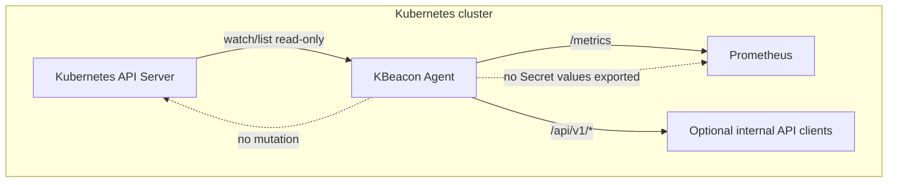
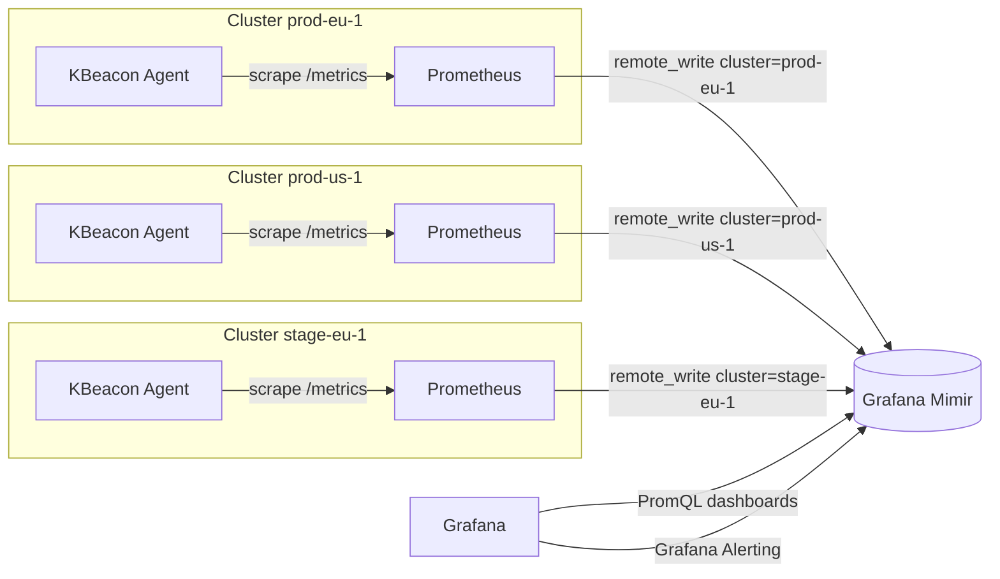
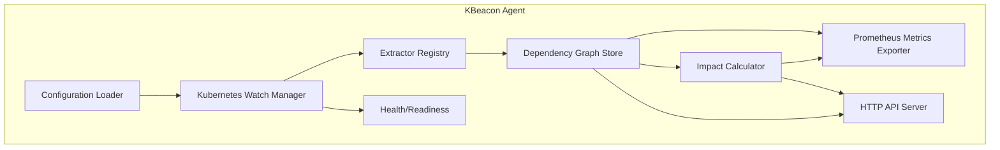
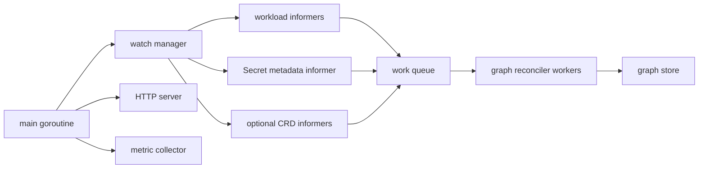
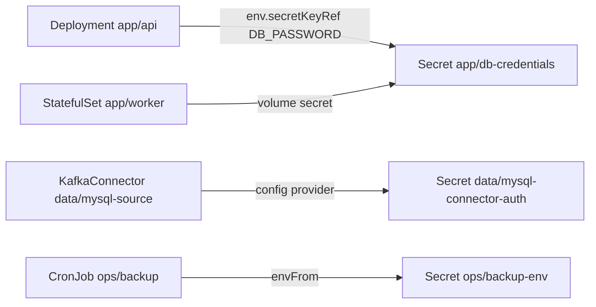
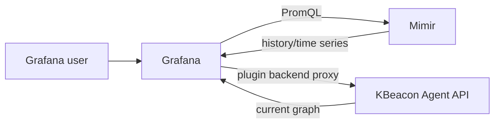

!!! note "Status of this document"
    This document includes both current implementation details and future design intent. For the implemented public contract of the current release, use the reference documentation, OpenAPI file, Helm values, and Go tests as the source of truth.


# KBeacon Technical Design

> Kubernetes-native Secret Dependency Intelligence for Prometheus, Grafana, and Mimir.

**Document status:** design baseline for initial public repository  
**Intended audience:** Kubernetes platform engineers, SREs, CNCF maintainers, Grafana dashboard/plugin engineers, security engineers, and contributors implementing KBeacon from scratch  
**Primary implementation language:** Go  
**Primary deployment mechanism:** Helm  
**Primary runtime artifact:** one lightweight KBeacon Agent Deployment per Kubernetes cluster

---

## Table of contents

- [1. Executive summary](#1-executive-summary)
- [2. Project vision](#2-project-vision)
- [3. Goals and non-goals](#3-goals-and-non-goals)
- [4. Terminology](#4-terminology)
- [5. Requirements](#5-requirements)
- [6. High-level architecture](#6-high-level-architecture)
- [7. Agent internals](#7-agent-internals)
- [8. Data model](#8-data-model)
- [9. Dependency discovery](#9-dependency-discovery)
- [10. Annotation contract](#10-annotation-contract)
- [11. Supported resources](#11-supported-resources)
- [12. Impact calculation](#12-impact-calculation)
- [13. Prometheus metrics](#13-prometheus-metrics)
- [14. HTTP API](#14-http-api)
- [15. Grafana dashboards](#15-grafana-dashboards)
- [16. Grafana Alerting](#16-grafana-alerting)
- [17. Multi-cluster architecture](#17-multi-cluster-architecture)
- [18. Deployment model](#18-deployment-model)
- [19. Configuration](#19-configuration)
- [20. Performance and scalability](#20-performance-and-scalability)
- [21. Security model](#21-security-model)
- [22. Reliability and failure modes](#22-reliability-and-failure-modes)
- [23. Testing strategy](#23-testing-strategy)
- [24. Extensibility](#24-extensibility)
- [25. Future roadmap](#25-future-roadmap)
- [26. Design decisions](#26-design-decisions)
- [27. Implementation plan](#27-implementation-plan)
- [28. Appendix A: examples](#28-appendix-a-examples)
- [29. Appendix B: references](#29-appendix-b-references)

---

**Implementation note:** this document includes long-term design intent and future roadmap items. The implemented public contract for the current release is in `docs/reference/*`, `docs/api/openapi.yaml`, `charts/kbeacon/values.yaml`, and the Go tests.

## 1. Executive summary

KBeacon is a Kubernetes-native Secret Dependency Intelligence platform. It discovers how Kubernetes Secrets are consumed by workloads, calculates the operational blast radius of Secret changes, and exposes that information through Prometheus metrics and a small HTTP API.

KBeacon is deliberately **not** a monitoring platform. It is designed to fit into the monitoring architecture most Kubernetes platform teams already operate:

- **KBeacon Agent** discovers dependencies inside a cluster.
- **Prometheus** scrapes KBeacon metrics.
- **Prometheus remote_write** forwards metrics to centralized **Grafana Mimir**.
- **Grafana** visualizes dependency intelligence and owns alerting workflows.

The product question is:

> If this Secret changes, what workloads are affected?

KBeacon answers the question at multiple levels:

- Which workloads reference this Secret?
- Which teams own those workloads?
- How many workloads are affected by a Secret update?
- Which clusters and namespaces contain affected workloads?
- Which Secrets have large dependency fan-out?
- Which workloads have unresolved or risky Secret references?
- Which Secret changes should trigger an operational review?

KBeacon keeps the runtime footprint small by avoiding storage and orchestration components that would turn it into a platform. The Agent maintains an in-memory dependency graph derived from Kubernetes watches, exposes the current state as metrics/API responses, and relies on Prometheus/Mimir for time series retention.

---

## 2. Project vision

Kubernetes Secrets are operationally important, but platform teams often lack a reliable answer to basic impact questions. A Secret rotation, certificate renewal, registry credential update, database password change, or connector credential update can affect many workloads. Without dependency intelligence, teams rely on tribal knowledge, manual `kubectl` searches, grep across manifests, or post-change incident response.

KBeacon provides a Kubernetes-native answer without replacing existing observability tools.

### 2.1 Product statement

KBeacon discovers Secret dependencies from Kubernetes workloads and selected platform CRDs, calculates impact, and emits dependency intelligence to Prometheus-compatible systems.

### 2.2 Operating model

KBeacon is deployed once per cluster as a normal Deployment. It watches resources read-only. It does not mutate workloads. It does not create custom resources. It does not intercept admission traffic. It does not send Slack, Teams, PagerDuty, or email notifications. Instead, it exposes a clean metrics and API contract that Grafana can visualize and alert on.

### 2.3 Design center

The design optimizes for:

- minimal infrastructure footprint;
- low operational risk;
- predictable Prometheus cardinality;
- strict separation between discovery, storage, visualization, and alerting;
- safe handling of Secret metadata;
- multi-cluster aggregation through labels rather than a custom backend;
- contributor-friendly implementation using established Kubernetes patterns.

---

## 3. Goals and non-goals

### 3.1 Goals

1. **Discover Secret dependencies** from core Kubernetes workloads and supported platform CRDs.
2. **Answer Secret impact questions** through metrics, API responses, and Grafana dashboards.
3. **Support infer, explicit, and hybrid discovery modes** so teams can start with automatic discovery and add annotations for ambiguous resources.
4. **Expose Prometheus metrics** with stable names, documented labels, and cardinality guidance.
5. **Expose an HTTP API** for dependency exploration and future Grafana plugin integration.
6. **Operate across many clusters** using Prometheus `remote_write` and Mimir label-based aggregation.
7. **Deploy with Helm** as one lightweight Deployment with optional ServiceMonitor support.
8. **Require read-only Kubernetes RBAC** and never export Secret data values.
9. **Remain extensible** through extractor interfaces and clear resource support boundaries.
10. **Provide production-quality open source documentation** suitable for public maintainers and contributors.

### 3.2 Non-goals

KBeacon explicitly does **not** provide:

- a custom web UI;
- a graph database;
- SQLite or another embedded database;
- Kafka or any queueing layer;
- a central correlator service;
- an operator as the default deployment mode;
- KBeacon-owned CRDs;
- admission webhooks;
- Secret mutation, rotation, or synchronization;
- Slack, Teams, PagerDuty, email, or webhook notification logic;
- AI-based dependency prediction;
- Secret value scanning or exfiltration;
- policy enforcement.

### 3.3 Important boundary

KBeacon is not a security scanner. It helps teams understand Secret dependency blast radius. The metadata it exposes can support security and compliance workflows, but KBeacon should not claim to validate whether Secrets are strong, encrypted, rotated correctly, or compliant with organizational policy.

---

## 4. Terminology

| Term | Meaning |
| --- | --- |
| Agent | The KBeacon process running inside one Kubernetes cluster. |
| Workload | A Kubernetes object that directly or indirectly defines Pods or represents a runtime integration using Secrets. |
| Secret dependency | A directed edge from a workload to a Secret. |
| SecretRef | A normalized reference to a Secret: cluster, namespace, name, and optional key. |
| WorkloadRef | A normalized reference to a workload: cluster, namespace, kind, name, API group, API version. |
| Dependency edge | A normalized record that says workload `W` depends on Secret `S`, including source path and discovery mode. |
| Discovery mode | `infer`, `explicit`, or `hybrid`. |
| Infer discovery | Dependencies extracted from Kubernetes resource fields. |
| Explicit discovery | Dependencies declared through `kbeacon.io/*` annotations. |
| Hybrid discovery | Union of infer and explicit results. |
| Impact | Workloads and teams affected if a Secret changes. |
| Fan-out | Number of workloads affected by one Secret. |
| Owner team | Team responsible for a workload or Secret, usually derived from annotation or namespace defaults. |
| Criticality | Operational importance of a Secret or workload: `low`, `medium`, `high`, `critical`. |
| Graph snapshot | The Agent's current in-memory dependency graph at a point in time. |
| Unresolved reference | A dependency reference to a Secret that does not currently exist or cannot be observed by the Agent. |

---

## 5. Requirements

### 5.1 Functional requirements

| ID | Requirement |
| --- | --- |
| FR-001 | Discover Secret usage from `env.valueFrom.secretKeyRef`. |
| FR-002 | Discover Secret usage from `envFrom.secretRef`. |
| FR-003 | Discover Secret usage from `volumes.secret.secretName`. |
| FR-004 | Discover Secret usage from `imagePullSecrets`. |
| FR-005 | Discover dependencies from Deployment Pod templates. |
| FR-006 | Discover dependencies from StatefulSet Pod templates. |
| FR-007 | Discover dependencies from DaemonSet Pod templates. |
| FR-008 | Discover dependencies from ReplicaSet Pod templates. |
| FR-009 | Discover dependencies from Pod specs. |
| FR-010 | Discover dependencies from Job Pod templates. |
| FR-011 | Discover dependencies from CronJob job templates. |
| FR-012 | Support Strimzi `KafkaConnector` resources. |
| FR-013 | Support Confluent for Kubernetes `Connector` resources. |
| FR-014 | Support explicit Secret dependencies through annotations. |
| FR-015 | Support workload/team ownership annotations. |
| FR-016 | Expose dependency graph metrics to Prometheus. |
| FR-017 | Expose Secret impact through HTTP API. |
| FR-018 | Expose workload dependencies through HTTP API. |
| FR-019 | Expose health and readiness endpoints. |
| FR-020 | Include cluster identity on every metric. |
| FR-021 | Provide Helm chart for deployment. |
| FR-022 | Provide Grafana dashboards and alert examples. |
| FR-023 | Do not export Secret data values. |
| FR-024 | Support namespace inclusion and exclusion filters. |
| FR-025 | Detect unresolved Secret references. |
| FR-026 | Emit Secret observed update timestamps and counters. |
| FR-027 | Calculate impact score per Secret. |
| FR-028 | Support optional ServiceMonitor creation for Prometheus Operator environments. |

### 5.2 Non-functional requirements

| ID | Requirement |
| --- | --- |
| NFR-001 | The Agent must be lightweight enough to run in every cluster. |
| NFR-002 | The Agent must use watches/informers rather than polling as the primary mechanism. |
| NFR-003 | The Agent must tolerate Kubernetes API disconnects and informer relists. |
| NFR-004 | The Agent must expose bounded-cardinality aggregate metrics by default. |
| NFR-005 | High-cardinality edge metrics must be configurable. |
| NFR-006 | The Agent must not require persistent storage. |
| NFR-007 | The Agent must not require leader election for the default single-replica deployment. |
| NFR-008 | The Agent API must be safe to expose only inside the cluster by default. |
| NFR-009 | The Agent must avoid logging Secret names at debug-disabled levels unless explicitly configured. |
| NFR-010 | The Agent must degrade gracefully if optional CRDs are absent. |
| NFR-011 | Startup must not fail only because Strimzi or Confluent CRDs are not installed. |
| NFR-012 | The Helm chart must not install KBeacon CRDs. |
| NFR-013 | RBAC must be read-only. |
| NFR-014 | Source code must be structured so new resource extractors can be added without modifying core graph logic. |

---

## 6. High-level architecture

### 6.1 Single-cluster architecture



The Agent uses Kubernetes watches and local caches to maintain a current dependency graph. Prometheus scrapes metrics from the Agent. Optional internal tools or a future Grafana plugin can query the Agent HTTP API for interactive dependency exploration.

### 6.2 Multi-cluster architecture



### 6.3 Runtime components



### 6.4 Responsibilities

| Component | Responsibility |
| --- | --- |
| Configuration Loader | Read flags/env/config file, validate cluster identity and feature gates. |
| Kubernetes Watch Manager | Start informers for supported resources and optional CRDs. |
| Extractor Registry | Dispatch resource objects to kind-specific extractors. |
| Dependency Graph Store | Maintain normalized workload, Secret, and edge indexes. |
| Impact Calculator | Calculate fan-out, affected workloads, owner/team aggregation, risk score. |
| Metrics Exporter | Expose Prometheus metrics derived from graph snapshots and Agent internals. |
| HTTP API Server | Serve dependency map, Secret impact, workload dependency, and health endpoints. |
| Health/Readiness | Report liveness and cache sync/readiness state. |

---

## 7. Agent internals

### 7.1 Process model

The Agent is a single Go process with one HTTP listener. It runs as one Kubernetes Deployment by default. A single replica is the recommended initial topology because KBeacon does not need horizontal scaling for most clusters and duplicate Agents would duplicate metrics unless carefully configured.

Default ports:

| Port | Name | Purpose |
| --- | --- | --- |
| `8080` | `http` | REST API and health endpoints. |
| `8080` | `metrics` | Prometheus metrics at `/metrics`. Same listener as API. |

### 7.2 Goroutine topology



Recommended default worker counts:

| Worker type | Default | Rationale |
| --- | ---: | --- |
| informer event handlers | per informer | Provided by client-go/controller-runtime. |
| graph reconciliation workers | `2` | Sufficient for moderate clusters; configurable for large clusters. |
| API server workers | Go HTTP server default | API is read-only and cheap. |
| metric collection | pull-based | Prometheus collector reads graph snapshot on scrape. |

### 7.3 Watch manager

The Watch Manager owns Kubernetes cache lifecycle.

Responsibilities:

1. Build REST config from in-cluster configuration or `--kubeconfig` for development.
2. Create informers for enabled resources.
3. Wait for cache sync before readiness returns success.
4. Register add/update/delete handlers.
5. Convert raw events into reconciliation keys.
6. Recover from watch reconnects and relists using Kubernetes client behavior.

The Agent should support two implementation styles:

- **controller-runtime cache** for typed core resources and optional unstructured resources;
- **client-go shared informers** for more direct control and lower dependency surface.

The recommended initial implementation uses `controller-runtime` because it provides a well-understood cache abstraction and easy mixed typed/unstructured support. The core graph logic must not depend on controller-runtime-specific types; extractors should accept normalized resource views.

### 7.4 Reconciliation model

KBeacon is not a controller that converges Kubernetes objects. It is a graph reconciler.

Event flow:

1. Watch event arrives for a resource object.
2. Event handler creates a `ResourceKey` containing group, version, kind, namespace, name, UID, and resourceVersion.
3. Key is added to a rate-limited work queue.
4. Worker retrieves latest object from cache.
5. Extractor returns zero or more dependency edges and workload metadata.
6. Graph Store replaces all edges owned by that workload key.
7. Impact indexes are incrementally updated.
8. Metrics reflect the next graph snapshot.

Delete flow:

1. Delete event arrives.
2. Graph Store removes workload node and all edges for that workload.
3. Reverse indexes for affected Secrets are updated.
4. If the deleted object is a Secret, Secret node is marked absent; edges may remain as unresolved references if workloads still reference it.

### 7.5 Snapshot concurrency

The graph store should expose read snapshots that are safe for concurrent API requests and metrics scrapes.

Recommended approach:

- Maintain mutable indexes behind a `sync.RWMutex`.
- Reconciliation acquires write lock for short critical sections.
- API and metrics acquire read lock, copy required view into response structures, release lock.
- Avoid holding locks while encoding JSON or rendering metrics.

For very large clusters, evolve to copy-on-write immutable snapshots, but the initial design should be simpler.

### 7.6 Logging

KBeacon must use structured logging.

Recommended fields:

| Field | Description |
| --- | --- |
| `cluster` | Configured cluster name. |
| `component` | `watcher`, `extractor`, `graph`, `api`, `metrics`, `config`. |
| `resource` | Resource kind when useful. |
| `namespace` | Namespace when safe and configured. |
| `name_hash` | Optional hash of object name when name redaction is enabled. |
| `event` | High-level event name. |

Default logs should avoid listing Secret names during normal operation. Debug mode can include Secret names when `logging.includeSecretNames=true`, but this must be off by default.

### 7.7 Error handling

Extractor errors should be non-fatal. A malformed annotation on one workload must not stop discovery for the cluster.

Error policy:

| Error | Behavior | Metric |
| --- | --- | --- |
| Invalid annotation value | Ignore that annotation, keep inferred dependencies if allowed. | `kbeacon_annotation_parse_errors_total` |
| Optional CRD absent | Disable that extractor and continue. | `kbeacon_optional_resource_unavailable` |
| Kubernetes watch error | Retry according to informer behavior. | `kbeacon_kubernetes_watch_errors_total` |
| API serialization error | Return HTTP 500. | `kbeacon_http_requests_total{code="500"}` |
| Secret reference unresolved | Keep edge marked unresolved. | `kbeacon_unresolved_secret_references` |

---

## 8. Data model

KBeacon models dependencies as a directed graph:



### 8.1 Identifiers

#### 8.1.1 Cluster identity

Every graph object contains a configured `cluster` value. It must be stable across Agent restarts and unique in the Mimir tenant.

Recommended cluster naming pattern:

```text
<environment>-<region>-<ordinal>
prod-eu-1
prod-us-2
stage-eu-1
```

Optionally, KBeacon can expose a `cluster_uid` field if configured manually. It should not attempt to infer a permanent cluster UID unless the implementation has a reliable source in the environment.

#### 8.1.2 SecretRef

```go
type SecretRef struct {
    Cluster   string `json:"cluster"`
    Namespace string `json:"namespace"`
    Name      string `json:"name"`
    Key       string `json:"key,omitempty"`
}
```

Rules:

- `namespace` is always set after normalization.
- `name` is required.
- `key` is optional and must not become a default Prometheus label.
- `cluster` comes from Agent configuration, not Kubernetes metadata.

#### 8.1.3 WorkloadRef

```go
type WorkloadRef struct {
    Cluster    string `json:"cluster"`
    Namespace  string `json:"namespace"`
    APIVersion string `json:"apiVersion"`
    Kind       string `json:"kind"`
    Name       string `json:"name"`
    UID        string `json:"uid,omitempty"`
}
```

Prometheus metrics should generally use `workload_kind` and `workload_name`, not UID. UID is stable for an object lifetime but high-cardinality and less useful in dashboards.

### 8.2 Dependency edge

```go
type DependencyEdge struct {
    ID              string            `json:"id"`
    Cluster         string            `json:"cluster"`
    Workload        WorkloadRef       `json:"workload"`
    Secret          SecretRef         `json:"secret"`
    DiscoveryMode   DiscoveryMode     `json:"discoveryMode"`
    Source          DependencySource  `json:"source"`
    Optional        bool              `json:"optional"`
    Resolved        bool              `json:"resolved"`
    OwnerTeam       string            `json:"ownerTeam,omitempty"`
    Criticality     string            `json:"criticality,omitempty"`
    Purpose         string            `json:"purpose,omitempty"`
    FirstObservedAt time.Time         `json:"firstObservedAt,omitempty"`
    LastObservedAt  time.Time         `json:"lastObservedAt,omitempty"`
    Labels          map[string]string `json:"labels,omitempty"`
}
```

`ID` must be deterministic:

```text
sha256(cluster + workloadRef + secretRef + discoveryMode + source.path)
```

### 8.3 Dependency source

```go
type DependencySource struct {
    Type          string `json:"type"`
    Path          string `json:"path"`
    Container     string `json:"container,omitempty"`
    InitContainer string `json:"initContainer,omitempty"`
    Ephemeral     bool   `json:"ephemeralContainer,omitempty"`
    Volume        string `json:"volume,omitempty"`
    EnvVar        string `json:"envVar,omitempty"`
    Annotation    string `json:"annotation,omitempty"`
    ResourceField string `json:"resourceField,omitempty"`
}
```

Source type values:

| Type | Meaning |
| --- | --- |
| `env_secret_key_ref` | Container environment variable references a Secret key. |
| `env_from_secret_ref` | Container imports all keys from a Secret. |
| `volume_secret` | Pod volume references a Secret. |
| `image_pull_secret` | Pod imagePullSecrets references a Secret. |
| `annotation_watch_secret` | Explicit annotation declares dependency. |
| `strimzi_config_provider` | Strimzi config provider syntax references Secret. |
| `confluent_mounted_secret` | Confluent connector mounted Secret reference. |
| `ingress.tls` | Ingress TLS Secret reference from `networking.k8s.io/v1` Ingress `spec.tls[].secretName`. |
| `future_external_secret_target` | Future ExternalSecret target Secret. |
| `future_secret_provider_class` | Future CSI SecretProviderClass dependency. |

### 8.4 Workload metadata

```go
type WorkloadMetadata struct {
    Ref              WorkloadRef        `json:"ref"`
    OwnerTeam        string             `json:"ownerTeam,omitempty"`
    Service          string             `json:"service,omitempty"`
    Environment      string             `json:"environment,omitempty"`
    Criticality      string             `json:"criticality,omitempty"`
    DiscoveryMode    DiscoveryMode      `json:"discoveryMode"`
    ResourceVersion  string             `json:"resourceVersion,omitempty"`
    Generation       int64              `json:"generation,omitempty"`
    Controller       *WorkloadRef       `json:"controller,omitempty"`
    DependencyCount  int                `json:"dependencyCount"`
    UnresolvedCount  int                `json:"unresolvedCount"`
    Annotations      map[string]string  `json:"annotations,omitempty"`
}
```

Only `kbeacon.io/*` annotations should be exposed by default through API responses. Arbitrary application annotations may contain sensitive data and should not be returned unless explicitly allowlisted.

### 8.5 Secret metadata

```go
type SecretMetadata struct {
    Ref                    SecretRef  `json:"ref"`
    Exists                 bool       `json:"exists"`
    Type                   string     `json:"type,omitempty"`
    OwnerTeam              string     `json:"ownerTeam,omitempty"`
    Criticality            string     `json:"criticality,omitempty"`
    ResourceVersion        string     `json:"resourceVersion,omitempty"`
    CreationTimestamp      time.Time  `json:"creationTimestamp,omitempty"`
    LastObservedChangeTime time.Time  `json:"lastObservedChangeTime,omitempty"`
    ObservedChangeCount    uint64     `json:"observedChangeCount"`
    AffectedWorkloadCount  int        `json:"affectedWorkloadCount"`
    ImpactScore            float64    `json:"impactScore"`
}
```

The Agent must not store or return Secret `data`, `stringData`, decoded values, or hashes of data values in API responses. Secret names and keys can themselves be sensitive, so the API must be cluster-internal by default.

### 8.6 Graph indexes

The graph store should maintain these indexes:

```text
workloadsByID:        map[WorkloadID]WorkloadNode
secretsByID:          map[SecretID]SecretNode
edgesByID:            map[EdgeID]DependencyEdge
edgesByWorkloadID:    map[WorkloadID]set[EdgeID]
edgesBySecretID:      map[SecretID]set[EdgeID]
workloadsByTeam:      map[Team]set[WorkloadID]
secretsByTeam:        map[Team]set[SecretID]
unresolvedBySecretID: map[SecretID]set[EdgeID]
```

This supports the primary queries without scanning all edges:

- Secret impact: lookup `edgesBySecretID`.
- Workload dependencies: lookup `edgesByWorkloadID`.
- Team overview: lookup `workloadsByTeam` and `secretsByTeam`.
- Unresolved references: lookup `unresolvedBySecretID`.

### 8.7 Edge deduplication

Hybrid discovery can produce duplicate dependencies. Example: a Deployment uses `envFrom.secretRef` and also declares the same Secret in `kbeacon.io/watch-secrets`.

Deduplication key:

```text
cluster + workload namespace + workload kind + workload name + secret namespace + secret name + optional key + source category
```

Recommended behavior:

- If inferred and explicit edges refer to the same workload and Secret, keep one edge with `discoveryMode="hybrid"` and `sources=[...]` in the API response.
- For Prometheus edge metrics, emit a single series with `discovery_mode="hybrid"` and a coarse `source="multiple"` label.
- Preserve detailed source information in HTTP API responses only, because detailed source paths increase metric cardinality.

---

## 9. Dependency discovery

KBeacon supports three discovery modes: `infer`, `explicit`, and `hybrid`.

### 9.1 Mode selection

Mode is resolved in this order:

1. Workload annotation `kbeacon.io/discovery-mode` if present.
2. Namespace annotation `kbeacon.io/discovery-mode` if enabled by config.
3. Agent default mode from configuration.
4. Built-in default: `hybrid`.

If `kbeacon.io/enabled="false"` is set on a workload, discovery for that workload is disabled regardless of mode. Namespace-level disable can also be enabled by configuration.

### 9.2 Infer mode

Infer mode extracts dependencies from well-known Kubernetes fields.

#### 9.2.1 `env.valueFrom.secretKeyRef`

Example:

```yaml
apiVersion: apps/v1
kind: Deployment
metadata:
  name: payments-api
  namespace: payments
spec:
  template:
    spec:
      containers:
        - name: api
          image: ghcr.io/example/payments-api:v1
          env:
            - name: DB_PASSWORD
              valueFrom:
                secretKeyRef:
                  name: payments-db
                  key: password
                  optional: false
```

Extracted edge:

```json
{
  "workload": "Deployment/payments/payments-api",
  "secret": "Secret/payments/payments-db#password",
  "source": {
    "type": "env_secret_key_ref",
    "path": "spec.template.spec.containers[api].env[DB_PASSWORD].valueFrom.secretKeyRef",
    "container": "api",
    "envVar": "DB_PASSWORD"
  },
  "optional": false
}
```

Rules:

- Secret namespace defaults to the workload namespace.
- `key` is captured for API responses but omitted from default metrics.
- `optional` is copied from the Kubernetes field.
- Env var names can be sensitive and must not be Prometheus labels.

#### 9.2.2 `envFrom.secretRef`

Example:

```yaml
containers:
  - name: api
    envFrom:
      - secretRef:
          name: payments-env
          optional: true
```

Extracted edge:

```json
{
  "secret": "Secret/payments/payments-env",
  "source": {
    "type": "env_from_secret_ref",
    "path": "spec.template.spec.containers[api].envFrom[0].secretRef",
    "container": "api"
  },
  "optional": true
}
```

Rules:

- Key is unknown because all keys may be imported.
- Prefixes from `envFrom.prefix` are not emitted to metrics.

#### 9.2.3 `volumes.secret`

Example:

```yaml
volumes:
  - name: tls
    secret:
      secretName: payments-tls
      optional: false
```

Extracted edge:

```json
{
  "secret": "Secret/payments/payments-tls",
  "source": {
    "type": "volume_secret",
    "path": "spec.template.spec.volumes[tls].secret",
    "volume": "tls"
  },
  "optional": false
}
```

Rules:

- `items[].key` can be captured in API details if present.
- Volume names are not default Prometheus labels.

#### 9.2.4 `imagePullSecrets`

Example:

```yaml
imagePullSecrets:
  - name: private-registry-credentials
```

Extracted edge:

```json
{
  "secret": "Secret/payments/private-registry-credentials",
  "source": {
    "type": "image_pull_secret",
    "path": "spec.template.spec.imagePullSecrets[private-registry-credentials]"
  }
}
```

Rules:

- Enabled by default because registry credential rotation can affect rollouts.
- Can be disabled globally with `discovery.includeImagePullSecrets=false` or per workload with `kbeacon.io/include-image-pull-secrets="false"`.

#### 9.2.5 Containers, init containers, and ephemeral containers

KBeacon must inspect:

- `spec.containers`
- `spec.initContainers`
- `spec.ephemeralContainers` when present

Ephemeral containers are usually diagnostic and should be included because they may reference Secrets in ad hoc debugging scenarios. They can be disabled with `discovery.includeEphemeralContainers=false`.

### 9.3 Explicit mode

Explicit mode uses annotations when dependencies cannot be reliably inferred from Pod templates or when teams want to declare ownership and intent.

Example:

```yaml
apiVersion: apps/v1
kind: Deployment
metadata:
  name: payments-api
  namespace: payments
  annotations:
    kbeacon.io/enabled: "true"
    kbeacon.io/discovery-mode: explicit
    kbeacon.io/watch-secrets: "payments-db#password, payments-jwt, shared/platform-ca"
    kbeacon.io/owner-team: payments-platform
    kbeacon.io/criticality: critical
spec:
  template:
    spec:
      containers:
        - name: api
          image: ghcr.io/example/payments-api:v1
```

Explicit extraction rules:

- `kbeacon.io/watch-secrets` is parsed as a comma-separated list.
- `secret` means same namespace as workload.
- `namespace/secret` means cross-namespace reference.
- `secret#key` or `namespace/secret#key` includes a Secret key.
- Whitespace is ignored around tokens.
- Invalid tokens are skipped and counted through `kbeacon_annotation_parse_errors_total`.

### 9.4 Hybrid mode

Hybrid mode combines inferred and explicit dependencies.

Hybrid is the recommended default because:

- Most Pod template dependencies are discovered automatically.
- Annotations cover non-standard patterns.
- Ownership metadata can be added without disabling inference.

Conflict behavior:

| Case | Behavior |
| --- | --- |
| Same Secret inferred and explicit | Merge into one dependency with mode `hybrid`. |
| Explicit Secret not present in inferred set | Add explicit dependency. |
| Inferred Secret listed in `kbeacon.io/ignore-secrets` | Remove it unless explicit dependency has `force=true` in JSON annotation. |
| Invalid explicit annotation | Keep inferred dependencies and emit parse error metric. |

### 9.5 Owner resolution

Owner metadata is resolved independently of dependency discovery.

Precedence:

1. Workload annotation `kbeacon.io/owner-team`.
2. Secret annotation `kbeacon.io/owner-team` for Secret-centric views.
3. Namespace annotation `kbeacon.io/owner-team` if namespace metadata watching is enabled.
4. Kubernetes recommended label `app.kubernetes.io/part-of` as service fallback, not team fallback.
5. Configured default owner: `unknown`.

The Agent should not infer teams from arbitrary labels unless configured. Team labels can have high cardinality and inconsistent spelling.

### 9.6 Criticality resolution

Criticality values:

- `low`
- `medium`
- `high`
- `critical`
- `unknown`

Precedence:

1. Secret annotation `kbeacon.io/criticality` for Secret impact score.
2. Workload annotation `kbeacon.io/criticality` for workload risk contribution.
3. Namespace annotation if enabled.
4. Configured default: `unknown`.

Invalid values become `unknown` and emit `kbeacon_annotation_parse_errors_total{annotation="kbeacon.io/criticality"}`.

### 9.7 Cross-namespace references

Native Pod Secret references are namespace-local. Some CRDs and annotations can represent cross-namespace references. KBeacon should support cross-namespace dependencies in the graph but mark them clearly.

Security considerations:

- Cross-namespace references can reveal platform coupling.
- RBAC must allow reading metadata for referenced namespaces or those references remain unresolved.
- Dashboards should make cross-namespace dependencies visually obvious.

### 9.8 Unresolved references

A dependency is unresolved when the referenced Secret is not present in the Agent's Secret metadata cache.

Common causes:

- Secret has not been created yet.
- Secret exists in an excluded namespace.
- Agent RBAC cannot list/watch Secrets in that namespace.
- Annotation has a typo.
- Optional Secret intentionally absent.

Unresolved references are not failures by themselves. They are graph facts. Dashboards and alerts can highlight them when they are unexpected.

---

## 10. Annotation contract

KBeacon annotations are optional. They provide control over discovery behavior, ownership, intent, and risk classification.

All annotations use the `kbeacon.io/` prefix.

### 10.1 Annotation scope

| Annotation | Workload | Secret | Namespace | Notes |
| --- | :---: | :---: | :---: | --- |
| `kbeacon.io/enabled` | yes | no | yes | Workload-level and namespace-level discovery toggle. |
| `kbeacon.io/discovery-mode` | yes | no | yes | `infer`, `explicit`, `hybrid`. |
| `kbeacon.io/watch-secrets` | yes | no | no | Explicit Secret dependency list. |
| `kbeacon.io/watch-secrets-json` | yes | no | no | Structured explicit dependency list. |
| `kbeacon.io/ignore-secrets` | yes | no | no | Ignore inferred dependencies. |
| `kbeacon.io/owner-team` | yes | yes | yes | Ownership aggregation. |
| `kbeacon.io/service` | yes | yes | yes | Service/application grouping. |
| `kbeacon.io/environment` | yes | yes | yes | Environment dimension. |
| `kbeacon.io/criticality` | yes | yes | yes | `low`, `medium`, `high`, `critical`. |
| `kbeacon.io/slo-tier` | yes | no | yes | Optional tier metadata. |
| `kbeacon.io/include-image-pull-secrets` | yes | no | no | Overrides global imagePullSecrets discovery. |
| `kbeacon.io/dependency-purpose` | yes | yes | no | Human-readable dependency purpose. |
| `kbeacon.io/external-id` | yes | yes | no | External CMDB/service catalog ID. |
| `kbeacon.io/change-risk` | no | yes | no | Risk override for Secret changes. |
| `kbeacon.io/notes` | yes | yes | no | Short human-readable note, API only. |

### 10.2 `kbeacon.io/enabled`

Enables or disables KBeacon discovery for a workload or namespace.

Valid values:

- `true`
- `false`

Default: `true`

Example:

```yaml
metadata:
  annotations:
    kbeacon.io/enabled: "false"
```

Rules:

- Workload-level value overrides namespace-level value.
- Disabled workloads are not included in dependency metrics.
- Disabled namespaces are skipped only when namespace annotations are enabled and the Agent watches Namespace metadata.

### 10.3 `kbeacon.io/discovery-mode`

Selects discovery behavior.

Valid values:

- `infer`
- `explicit`
- `hybrid`

Default: Agent config, usually `hybrid`.

Example:

```yaml
metadata:
  annotations:
    kbeacon.io/discovery-mode: hybrid
```

### 10.4 `kbeacon.io/watch-secrets`

Declares explicit dependencies as a comma-separated list.

Grammar:

```ebnf
watchSecrets  = secretRef, { ",", secretRef } ;
secretRef     = [ namespace, "/" ], name, [ "#", key ] ;
namespace     = dnsLabel ;
name          = dnsSubdomain ;
key           = secretKeyName ;
```

Examples:

```yaml
metadata:
  annotations:
    kbeacon.io/watch-secrets: "db-credentials#password, jwt-signing-key, shared/platform-ca"
```

Parsed references:

| Token | Namespace | Secret | Key |
| --- | --- | --- | --- |
| `db-credentials#password` | workload namespace | `db-credentials` | `password` |
| `jwt-signing-key` | workload namespace | `jwt-signing-key` | empty |
| `shared/platform-ca` | `shared` | `platform-ca` | empty |

### 10.5 `kbeacon.io/watch-secrets-json`

Structured dependency declaration for teams that need purpose, optionality, or force semantics.

Example:

```yaml
metadata:
  annotations:
    kbeacon.io/watch-secrets-json: |
      [
        {
          "namespace": "payments",
          "name": "payments-db",
          "key": "password",
          "purpose": "postgres authentication",
          "criticality": "critical",
          "optional": false
        },
        {
          "namespace": "shared",
          "name": "platform-ca",
          "purpose": "TLS trust bundle",
          "force": true
        }
      ]
```

Schema:

```json
{
  "type": "array",
  "items": {
    "type": "object",
    "required": ["name"],
    "properties": {
      "namespace": {"type": "string"},
      "name": {"type": "string"},
      "key": {"type": "string"},
      "purpose": {"type": "string"},
      "criticality": {"enum": ["low", "medium", "high", "critical"]},
      "optional": {"type": "boolean"},
      "force": {"type": "boolean"}
    }
  }
}
```

Rules:

- If both `watch-secrets` and `watch-secrets-json` are present, use the union.
- `watch-secrets-json` is preferred for complex dependencies.
- Invalid JSON causes that annotation to be ignored and increments parse error metrics.

### 10.6 `kbeacon.io/ignore-secrets`

Removes inferred dependencies from the workload graph.

Example:

```yaml
metadata:
  annotations:
    kbeacon.io/ignore-secrets: "default-token, dev-only-secret"
```

Rules:

- Applies only to inferred dependencies.
- Does not remove dependencies explicitly declared with `force=true` in `watch-secrets-json`.
- Useful when injected resources create noisy or irrelevant references.

### 10.7 `kbeacon.io/owner-team`

Declares owning team.

Example:

```yaml
metadata:
  annotations:
    kbeacon.io/owner-team: payments-platform
```

Recommendations:

- Use stable team slugs, not display names.
- Keep values low-cardinality.
- Avoid user names or email addresses.

### 10.8 `kbeacon.io/service`

Declares service/application grouping.

Example:

```yaml
metadata:
  annotations:
    kbeacon.io/service: payments-api
```

This is useful for dashboards and API filtering. It is not included on all default metrics to avoid unnecessary cardinality.

### 10.9 `kbeacon.io/environment`

Declares environment classification.

Example:

```yaml
metadata:
  annotations:
    kbeacon.io/environment: prod
```

Recommended values:

- `prod`
- `stage`
- `dev`
- `test`
- organization-specific stable slugs

### 10.10 `kbeacon.io/criticality`

Declares operational criticality.

Example:

```yaml
metadata:
  annotations:
    kbeacon.io/criticality: critical
```

Valid values:

- `low`
- `medium`
- `high`
- `critical`

Used by impact scoring and alert routing.

### 10.11 `kbeacon.io/slo-tier`

Optional tier annotation.

Example:

```yaml
metadata:
  annotations:
    kbeacon.io/slo-tier: tier-0
```

KBeacon does not interpret SLO tier by default, but it can be copied into API responses and future plugin views.

### 10.12 `kbeacon.io/include-image-pull-secrets`

Per-workload override for imagePullSecrets discovery.

Example:

```yaml
metadata:
  annotations:
    kbeacon.io/include-image-pull-secrets: "false"
```

### 10.13 `kbeacon.io/dependency-purpose`

Human-readable dependency purpose.

Example:

```yaml
metadata:
  annotations:
    kbeacon.io/dependency-purpose: "database credentials and TLS material"
```

This should be returned by API but not emitted as a Prometheus label.

### 10.14 `kbeacon.io/external-id`

Links a workload or Secret to an external CMDB/service catalog ID.

Example:

```yaml
metadata:
  annotations:
    kbeacon.io/external-id: "svc:payments-api"
```

This is API-only by default.

### 10.15 `kbeacon.io/change-risk`

Secret-level change risk override.

Example:

```yaml
metadata:
  annotations:
    kbeacon.io/change-risk: high
```

Valid values:

- `low`
- `medium`
- `high`
- `critical`

This influences impact score independently from workload criticality.

### 10.16 `kbeacon.io/notes`

Short human-readable note.

Example:

```yaml
metadata:
  annotations:
    kbeacon.io/notes: "Rotated by external-secrets every 30 days. Coordinate with data-platform."
```

Notes can contain operationally sensitive information and must not be emitted as labels.

---

## 11. Supported resources

KBeacon treats resources as dependency extraction sources. It does not own their lifecycle.

### 11.1 Support matrix

| Resource | API group/version | Status | Discovery approach | Notes |
| --- | --- | --- | --- | --- |
| Pod | `v1` | MVP | Infer + explicit | Direct Pod specs. |
| Deployment | `apps/v1` | MVP | Pod template + explicit | Preferred workload view. |
| StatefulSet | `apps/v1` | MVP | Pod template + explicit | Important for databases and brokers. |
| DaemonSet | `apps/v1` | MVP | Pod template + explicit | Node agents often use image pull and TLS Secrets. |
| ReplicaSet | `apps/v1` | MVP | Pod template + explicit | Usually normalized to owning Deployment when configured. |
| Job | `batch/v1` | MVP | Pod template + explicit | Batch credentials and backup jobs. |
| CronJob | `batch/v1` | MVP | Job template Pod template + explicit | Scheduled credential use. |
| KafkaConnector | `kafka.strimzi.io/v1beta2` | MVP optional | Config provider pattern + explicit | Optional unstructured watcher. |
| Connector | `platform.confluent.io/v1beta1` | MVP optional | Mounted Secret/config patterns + explicit | Optional unstructured watcher. |
| Ingress | `networking.k8s.io/v1` | Future | TLS Secret inference | `spec.tls[].secretName`. |
| ExternalSecret | ESO CRD | Future | Target Secret and provider refs | Maps external source to K8s Secret. |
| SecretProviderClass | Secrets Store CSI Driver CRD | Future | CSI volume + secretObjects | Bridges external vaults and Kubernetes Secrets. |

### 11.2 Workload normalization

Kubernetes resources can reference each other through owner references. KBeacon must avoid double-counting when both Pods and higher-level controllers are watched.

Recommended default normalization:

| Observed object | Normalized workload | Rationale |
| --- | --- | --- |
| Deployment | Deployment | Top-level desired workload. |
| ReplicaSet owned by Deployment | Deployment if owner can be resolved, otherwise ReplicaSet | Avoid double-counting Deployment and ReplicaSet. |
| Pod owned by ReplicaSet owned by Deployment | Deployment if owner chain resolved, otherwise Pod | Avoid counting each Pod replica. |
| Pod owned by StatefulSet | StatefulSet | Avoid per-Pod cardinality. |
| Pod owned by DaemonSet | DaemonSet | Avoid per-node cardinality. |
| Pod owned by Job owned by CronJob | CronJob if owner chain resolved, otherwise Job | CronJob is desired object. |
| Standalone Pod | Pod | No higher-level owner. |
| Job not owned by CronJob | Job | Batch workload. |

Configuration:

```yaml
discovery:
  ownerResolution:
    enabled: true
    preferController: true
    includeReplicaSets: false
    includePodsControlledByWorkloads: false
```

Default metrics should use normalized workloads. The API can optionally expose raw Pod-level edges if `api.includeRawEdges=true`.

### 11.3 Pod template extraction

All Pod-template-based resources should use the same extractor function:

```go
type PodTemplateSource struct {
    WorkloadRef WorkloadRef
    Namespace   string
    Template    corev1.PodTemplateSpec
    Metadata    metav1.ObjectMeta
}

func ExtractFromPodSpec(source PodTemplateSource, spec corev1.PodSpec, opts ExtractOptions) ([]DependencyEdge, []Diagnostic)
```

Supported fields:

```text
spec.containers[*].env[*].valueFrom.secretKeyRef
spec.containers[*].envFrom[*].secretRef
spec.initContainers[*].env[*].valueFrom.secretKeyRef
spec.initContainers[*].envFrom[*].secretRef
spec.ephemeralContainers[*].env[*].valueFrom.secretKeyRef
spec.ephemeralContainers[*].envFrom[*].secretRef
spec.volumes[*].secret.secretName
spec.imagePullSecrets[*].name
```

### 11.4 Deployment

Source path root:

```text
spec.template.spec
```

Implementation note:

- Extract annotations from Deployment metadata, not only Pod template metadata.
- Optionally merge Pod template annotations if `discovery.readPodTemplateAnnotations=true`.
- WorkloadRef kind is `Deployment`, apiVersion `apps/v1`.

### 11.5 StatefulSet

Same as Deployment, using `spec.template.spec`.

StatefulSets often hold stateful credentials. Dashboards should make StatefulSet impact visible because credential changes may require controlled restart sequencing.

### 11.6 DaemonSet

Same as Deployment, using `spec.template.spec`.

DaemonSet fan-out should represent one workload by default, not one Pod per node. A node-level view can be a future enhancement.

### 11.7 ReplicaSet

ReplicaSets are useful when Deployments are not available or owner resolution is disabled.

Default behavior:

- Watch ReplicaSets to support owner resolution and direct ReplicaSet users.
- Do not emit ReplicaSet dependencies separately when owned by a Deployment and `includeReplicaSets=false`.

### 11.8 Pod

Direct Pod extraction supports:

- standalone Pods;
- static-style workloads created without controllers;
- debugging scenarios;
- optional raw edge output.

Default behavior:

- Controlled Pods are normalized to their owners.
- Standalone Pods are included.
- Pod names are high-cardinality; teams can disable direct Pod metrics with `metrics.includePodWorkloads=false`.

### 11.9 Job

Job extraction uses:

```text
spec.template.spec
```

Default behavior:

- Jobs owned by CronJobs can be normalized to CronJob.
- Standalone Jobs are included as `Job` workloads.
- Completed Jobs can remain in cache while present in the API server. KBeacon reflects current objects, not historical executions.

### 11.10 CronJob

CronJob extraction uses:

```text
spec.jobTemplate.spec.template.spec
```

CronJobs are especially important for backup, ETL, reporting, and rotation tasks. Their Secrets are often critical even when the workload has no continuously running Pods.

### 11.11 Strimzi KafkaConnector

Strimzi `KafkaConnector` resources are optional and watched only if enabled. KBeacon must not fail when the Strimzi CRD is absent.

Recommended GVK:

```yaml
apiVersion: kafka.strimzi.io/v1beta2
kind: KafkaConnector
```

Extraction strategies:

1. **Explicit annotations**: always supported.
2. **Strimzi Kubernetes Config Provider pattern**: parse string values in `spec.config` for references like:

```text
${secrets:namespace/secret-name:key}
${secrets:secret-name:key}
```

Example:

```yaml
apiVersion: kafka.strimzi.io/v1beta2
kind: KafkaConnector
metadata:
  name: mysql-source
  namespace: data
  labels:
    strimzi.io/cluster: connect-a
  annotations:
    kbeacon.io/owner-team: data-platform
spec:
  class: io.debezium.connector.mysql.MySqlConnector
  tasksMax: 1
  config:
    database.hostname: mysql.prod.svc
    database.user: debezium
    database.password: ${secrets:data/mysql-source-db:password}
```

Extracted edge:

```json
{
  "workload": {
    "apiVersion": "kafka.strimzi.io/v1beta2",
    "kind": "KafkaConnector",
    "namespace": "data",
    "name": "mysql-source"
  },
  "secret": {
    "namespace": "data",
    "name": "mysql-source-db",
    "key": "password"
  },
  "source": {
    "type": "strimzi_config_provider",
    "path": "spec.config.database.password"
  }
}
```

Implementation details:

- Use unstructured object access to avoid compile-time dependency on Strimzi packages.
- Parse only string values by default.
- Regex must be conservative and documented.
- Do not parse arbitrary nested secrets from unknown fields unless the extractor is explicitly configured.

Suggested regex:

```regex
\$\{secrets:((?P<namespace>[a-z0-9]([-a-z0-9]*[a-z0-9])?)/)?(?P<name>[A-Za-z0-9._-]+):(?P<key>[A-Za-z0-9._-]+)\}
```

### 11.12 Confluent for Kubernetes Connector

Confluent for Kubernetes `Connector` resources are optional and watched only if enabled.

Recommended GVK:

```yaml
apiVersion: platform.confluent.io/v1beta1
kind: Connector
```

Extraction strategies:

1. Explicit annotations.
2. Mounted Secret references in connector configuration when they follow configured path conventions.
3. Future richer support for CFK Connect resource relationships.

Example:

```yaml
apiVersion: platform.confluent.io/v1beta1
kind: Connector
metadata:
  name: jdbc-sink
  namespace: data
  annotations:
    kbeacon.io/owner-team: data-platform
    kbeacon.io/watch-secrets-json: |
      [{"name":"jdbc-sink-credentials","key":"password","purpose":"JDBC sink database password"}]
spec:
  class: io.confluent.connect.jdbc.JdbcSinkConnector
  taskMax: 2
  configs:
    connection.url: jdbc:postgresql://postgres:5432/app
    connection.user: sink
    connection.password: ${file:/mnt/secrets/jdbc-sink-credentials/password:password}
```

Because Confluent secret reference formats may vary by deployment pattern, explicit annotations should be the primary MVP mechanism for `Connector`. Path-based inference can be enabled through config:

```yaml
resources:
  confluentConnector:
    enabled: true
    inferMountedSecrets: true
    mountedSecretPathPrefixes:
      - /mnt/secrets
```

### 11.13 Future: Ingress

Ingress TLS Secret extraction:

```text
spec.tls[*].secretName
```

Potential edge:

```text
Ingress namespace/name -> Secret namespace/spec.tls[].secretName
```

Design question for future: Ingress is not a workload. KBeacon can model it as a `WorkloadRef` kind `Ingress` or introduce a more generic `ConsumerRef`. The MVP should keep `WorkloadRef` but define the term as any Secret-consuming Kubernetes object.

### 11.14 Future: ExternalSecret

External Secrets Operator commonly creates or manages Kubernetes Secrets from external providers. KBeacon future support should model:

- ExternalSecret -> target Secret
- ExternalSecret -> SecretStore/ClusterSecretStore metadata
- workloads -> generated target Secret

KBeacon should still avoid reading external provider values.

### 11.15 Future: SecretProviderClass

Secrets Store CSI Driver can mount external secrets into Pods and optionally sync Kubernetes Secrets.

Future extraction sources:

- Pod volumes using CSI driver `secrets-store.csi.k8s.io` and `volumeAttributes.secretProviderClass`.
- SecretProviderClass `spec.secretObjects[*].secretName`.

This requires careful modeling because mounted data may not correspond to a Kubernetes Secret.

---

## 12. Impact calculation

Impact is the operational blast radius of a Secret change.

### 12.1 Basic impact

For a Secret `S`, affected workloads are:

```text
affectedWorkloads(S) = unique workloads W where edge(W -> S) exists
```

Affected workload count:

```text
fanout(S) = count(affectedWorkloads(S))
```

Affected teams:

```text
affectedTeams(S) = unique ownerTeam(W) for W in affectedWorkloads(S)
```

Affected namespaces:

```text
affectedNamespaces(S) = unique namespace(W) for W in affectedWorkloads(S)
```

### 12.2 Impact dimensions

KBeacon should calculate impact using these dimensions:

| Dimension | Source | Example |
| --- | --- | --- |
| Fan-out | Graph edges | Secret used by 37 workloads. |
| Workload criticality | Workload annotations or namespace defaults | Critical API depends on Secret. |
| Secret criticality | Secret annotations | TLS root CA marked critical. |
| Environment | Annotations/config | Production Secret has higher risk. |
| Cross-namespace use | Edge namespace comparison | Shared Secret affects multiple namespaces. |
| Unresolved references | Graph diagnostics | Workload expects missing Secret. |
| Recent observed change | Secret watch metadata | Secret updated in last 15 minutes. |
| Team spread | Owner aggregation | Secret affects 5 teams. |

### 12.3 Impact score

KBeacon exposes `kbeacon_secret_impact_score` as a gauge from `0` to `100`.

Recommended initial formula:

```text
fanoutScore        = min(40, fanout * 2)
criticalityScore   = max(secretCriticalityWeight, maxWorkloadCriticalityWeight)
environmentScore   = environmentWeight
teamSpreadScore    = min(10, affectedTeamCount * 2)
namespaceScore     = min(10, affectedNamespaceCount * 2)
unresolvedPenalty  = min(10, unresolvedReferenceCount * 2)
recentChangeScore  = 10 if changedWithinRecentWindow else 0

impactScore = min(100,
  fanoutScore +
  criticalityScore +
  environmentScore +
  teamSpreadScore +
  namespaceScore +
  unresolvedPenalty +
  recentChangeScore
)
```

Default weights:

```yaml
impact:
  recentChangeWindow: 15m
  criticalityWeights:
    unknown: 0
    low: 2
    medium: 8
    high: 18
    critical: 30
  environmentWeights:
    dev: 0
    test: 0
    stage: 5
    prod: 10
  fanout:
    pointsPerWorkload: 2
    maxPoints: 40
  teamSpread:
    pointsPerTeam: 2
    maxPoints: 10
  namespaceSpread:
    pointsPerNamespace: 2
    maxPoints: 10
  unresolvedReferences:
    pointsPerReference: 2
    maxPoints: 10
```

### 12.4 Score interpretation

| Score | Risk band | Interpretation |
| ---: | --- | --- |
| `0-19` | low | Small blast radius or non-critical usage. |
| `20-49` | medium | Review before planned changes. |
| `50-79` | high | Coordinate with owners and monitor post-change. |
| `80-100` | critical | Treat change as high-risk operational event. |

Score thresholds must be dashboard variables and alert configuration, not hard-coded product behavior.

### 12.5 Change detection

KBeacon observes Secret update events through the Kubernetes API. It increments a counter and sets a timestamp whenever an observed Secret object changes resourceVersion.

Important semantic note:

- `kbeacon_secret_last_changed_timestamp_seconds` means **last observed Kubernetes Secret update**, not guaranteed payload/data change.
- Metadata-only changes, label updates, owner reference changes, or external controller rewrites can trigger it.
- KBeacon deliberately avoids reading or exporting Secret values. Therefore, it should not attempt to claim a data-only diff unless a future optional mode is explicitly implemented and security-reviewed.

### 12.6 Change windows

The Agent does not persist history. After restart, it reconstructs current dependency state from Kubernetes and initializes observed change counters from runtime events only.

Consequences:

- Prometheus/Mimir preserve historical metric samples after restart.
- Agent-local counters reset on restart unless process metrics indicate start time.
- Dashboards should use Prometheus functions like `increase()` and `changes()` over stored time series.

Recommended restart-aware queries:

```promql
increase(kbeacon_secret_changes_total[1h])
```

```promql
(time() - kbeacon_secret_last_changed_timestamp_seconds) < 900
```

### 12.7 Affected workload list ordering

API responses should sort impacted workloads by:

1. criticality descending;
2. owner team ascending;
3. namespace ascending;
4. kind ascending;
5. name ascending.

This makes API responses deterministic and useful in Grafana tables.

---

## 13. Prometheus metrics

KBeacon metrics are the primary integration surface. They must follow Prometheus conventions and be stable, documented, and consciously designed for cardinality.

### 13.1 Metric naming principles

- All KBeacon metrics use the `kbeacon_` prefix.
- Counters end with `_total`.
- Durations use seconds and end with `_seconds`.
- Timestamps use Unix seconds and end with `_timestamp_seconds`.
- Info metrics end with `_info` and have value `1`.
- Avoid embedding labels in metric names.
- Avoid unbounded labels such as Pod UID, Secret key, resourceVersion, random hashes, error messages, or annotation values.

### 13.2 Required global labels

Every KBeacon domain metric must include:

| Label | Required | Description |
| --- | :---: | --- |
| `cluster` | yes | Stable cluster name configured in Agent. |

Many metrics include:

| Label | Description |
| --- | --- |
| `namespace` | Workload namespace for workload-centric metrics. |
| `secret_namespace` | Secret namespace for Secret-centric metrics. |
| `secret_name` | Secret name. High-cardinality but central to KBeacon's purpose. |
| `workload_kind` | Kubernetes kind: `Deployment`, `StatefulSet`, etc. |
| `workload_name` | Workload name. High-cardinality but required for dependency queries. |
| `owner_team` | Stable team slug. Use `unknown` when missing. |
| `criticality` | `unknown`, `low`, `medium`, `high`, `critical`. |
| `discovery_mode` | `infer`, `explicit`, `hybrid`. |
| `source` | Coarse source type, not full JSON path. |

### 13.3 Domain metrics

#### 13.3.1 `kbeacon_dependency_edges`

Type: Gauge  
Unit: edges  
Default: enabled only when `metrics.edge.enabled=true`  
Value: `1` for each current dependency edge.

Labels:

| Label | Description |
| --- | --- |
| `cluster` | Cluster name. |
| `namespace` | Workload namespace. |
| `workload_kind` | Normalized workload kind. |
| `workload_name` | Normalized workload name. |
| `secret_namespace` | Secret namespace. |
| `secret_name` | Secret name. |
| `discovery_mode` | `infer`, `explicit`, `hybrid`. |
| `source` | Coarse dependency source. |
| `resolved` | `true` if Secret exists in cache. |
| `owner_team` | Workload owner team or `unknown`. |

Example:

```text
kbeacon_dependency_edges{cluster="prod-eu-1",namespace="payments",workload_kind="Deployment",workload_name="payments-api",secret_namespace="payments",secret_name="payments-db",discovery_mode="hybrid",source="env_secret_key_ref",resolved="true",owner_team="payments-platform"} 1
```

Cardinality warning: This metric has one time series per dependency edge. It is valuable for PromQL exploration but can be expensive in very large clusters. Keep enabled for most clusters; disable or filter namespaces for very high-scale environments.

#### 13.3.2 `kbeacon_workload_dependency_count`

Type: Gauge  
Unit: dependencies  
Default: enabled

Value: Number of unique Secrets referenced by a workload.

Labels:

| Label | Description |
| --- | --- |
| `cluster` | Cluster name. |
| `namespace` | Workload namespace. |
| `workload_kind` | Workload kind. |
| `workload_name` | Workload name. |
| `owner_team` | Owner team. |
| `criticality` | Workload criticality. |

Example:

```text
kbeacon_workload_dependency_count{cluster="prod-eu-1",namespace="payments",workload_kind="Deployment",workload_name="payments-api",owner_team="payments-platform",criticality="critical"} 4
```

#### 13.3.3 `kbeacon_secret_affected_workload_count`

Type: Gauge  
Unit: workloads  
Default: enabled

Value: Number of unique workloads affected by a Secret.

Labels:

| Label | Description |
| --- | --- |
| `cluster` | Cluster name. |
| `secret_namespace` | Secret namespace. |
| `secret_name` | Secret name. |
| `criticality` | Secret criticality. |
| `owner_team` | Secret owner team if known, otherwise `unknown`. |

Example:

```text
kbeacon_secret_affected_workload_count{cluster="prod-eu-1",secret_namespace="payments",secret_name="payments-db",criticality="critical",owner_team="payments-platform"} 7
```

#### 13.3.4 `kbeacon_secret_affected_team_count`

Type: Gauge  
Unit: teams

Value: Number of distinct owner teams affected by a Secret.

Labels:

| Label | Description |
| --- | --- |
| `cluster` | Cluster name. |
| `secret_namespace` | Secret namespace. |
| `secret_name` | Secret name. |

Example:

```text
kbeacon_secret_affected_team_count{cluster="prod-eu-1",secret_namespace="shared",secret_name="platform-ca"} 6
```

#### 13.3.5 `kbeacon_secret_affected_namespace_count`

Type: Gauge  
Unit: namespaces

Value: Number of distinct workload namespaces affected by a Secret.

Labels:

| Label | Description |
| --- | --- |
| `cluster` | Cluster name. |
| `secret_namespace` | Secret namespace. |
| `secret_name` | Secret name. |

#### 13.3.6 `kbeacon_secret_impact_score`

Type: Gauge  
Unit: score `0-100`

Labels:

| Label | Description |
| --- | --- |
| `cluster` | Cluster name. |
| `secret_namespace` | Secret namespace. |
| `secret_name` | Secret name. |
| `criticality` | Secret criticality. |
| `owner_team` | Secret owner team if known. |

Example:

```text
kbeacon_secret_impact_score{cluster="prod-eu-1",secret_namespace="shared",secret_name="platform-ca",criticality="critical",owner_team="platform-security"} 94
```

#### 13.3.7 `kbeacon_secret_last_changed_timestamp_seconds`

Type: Gauge  
Unit: Unix timestamp seconds

Value: Last observed update time for a Secret during Agent runtime.

Labels:

| Label | Description |
| --- | --- |
| `cluster` | Cluster name. |
| `secret_namespace` | Secret namespace. |
| `secret_name` | Secret name. |

Example:

```text
kbeacon_secret_last_changed_timestamp_seconds{cluster="prod-eu-1",secret_namespace="payments",secret_name="payments-db"} 1782476400
```

#### 13.3.8 `kbeacon_secret_changes_total`

Type: Counter  
Unit: changes

Value: Number of observed Secret update events during Agent runtime.

Labels:

| Label | Description |
| --- | --- |
| `cluster` | Cluster name. |
| `secret_namespace` | Secret namespace. |
| `secret_name` | Secret name. |
| `change_type` | `observed_update`, reserved for future values. |

Example:

```text
kbeacon_secret_changes_total{cluster="prod-eu-1",secret_namespace="payments",secret_name="payments-db",change_type="observed_update"} 3
```

#### 13.3.9 `kbeacon_secret_info`

Type: Gauge info metric  
Value: `1`

Labels:

| Label | Description |
| --- | --- |
| `cluster` | Cluster name. |
| `secret_namespace` | Secret namespace. |
| `secret_name` | Secret name. |
| `secret_type` | Kubernetes Secret type, normalized. |
| `owner_team` | Owner team. |
| `criticality` | Criticality. |
| `environment` | Environment if configured and low-cardinality. |

Example:

```text
kbeacon_secret_info{cluster="prod-eu-1",secret_namespace="payments",secret_name="payments-db",secret_type="Opaque",owner_team="payments-platform",criticality="critical",environment="prod"} 1
```

Cardinality warning: This metric has one series per Secret. Keep label values stable.

#### 13.3.10 `kbeacon_workload_info`

Type: Gauge info metric  
Value: `1`

Labels:

| Label | Description |
| --- | --- |
| `cluster` | Cluster name. |
| `namespace` | Workload namespace. |
| `workload_kind` | Workload kind. |
| `workload_name` | Workload name. |
| `owner_team` | Owner team. |
| `criticality` | Criticality. |
| `service` | Optional if enabled. |

Default: `service` label disabled unless `metrics.includeServiceLabel=true`.

#### 13.3.11 `kbeacon_team_dependency_count`

Type: Gauge  
Unit: dependencies

Value: Number of dependency edges owned by a team.

Labels:

| Label | Description |
| --- | --- |
| `cluster` | Cluster name. |
| `owner_team` | Team slug. |

#### 13.3.12 `kbeacon_team_affected_secret_count`

Type: Gauge  
Unit: Secrets

Value: Number of Secrets that affect at least one workload owned by a team.

Labels:

| Label | Description |
| --- | --- |
| `cluster` | Cluster name. |
| `owner_team` | Team slug. |

#### 13.3.13 `kbeacon_cluster_dependency_count`

Type: Gauge  
Unit: dependencies

Value: Total dependency edges in a cluster.

Labels:

| Label | Description |
| --- | --- |
| `cluster` | Cluster name. |

#### 13.3.14 `kbeacon_cluster_secret_count`

Type: Gauge  
Unit: Secrets

Value: Number of observed Secret metadata objects.

Labels:

| Label | Description |
| --- | --- |
| `cluster` | Cluster name. |

#### 13.3.15 `kbeacon_cluster_workload_count`

Type: Gauge  
Unit: workloads

Value: Number of normalized workloads observed by KBeacon.

Labels:

| Label | Description |
| --- | --- |
| `cluster` | Cluster name. |

#### 13.3.16 `kbeacon_unresolved_secret_references`

Type: Gauge  
Unit: references

Value: Number of dependency edges referencing missing or unobservable Secrets.

Labels:

| Label | Description |
| --- | --- |
| `cluster` | Cluster name. |
| `namespace` | Workload namespace. |
| `workload_kind` | Workload kind. |
| `workload_name` | Workload name. |
| `secret_namespace` | Referenced Secret namespace. |
| `secret_name` | Referenced Secret name. |
| `optional` | `true` or `false`. |

#### 13.3.17 `kbeacon_discovery_mode_workload_count`

Type: Gauge  
Unit: workloads

Value: Count of workloads by resolved discovery mode.

Labels:

| Label | Description |
| --- | --- |
| `cluster` | Cluster name. |
| `discovery_mode` | `infer`, `explicit`, `hybrid`, `disabled`. |

### 13.4 Agent/runtime metrics

#### 13.4.1 `kbeacon_build_info`

Type: Gauge info metric  
Value: `1`

Labels:

| Label | Description |
| --- | --- |
| `version` | Semantic version. |
| `commit` | Git commit. |
| `go_version` | Go runtime version. |

#### 13.4.2 `kbeacon_agent_info`

Type: Gauge info metric  
Value: `1`

Labels:

| Label | Description |
| --- | --- |
| `cluster` | Cluster name. |
| `namespace` | Agent namespace. |
| `pod` | Agent Pod name, optional and disabled by default due to restarts/cardinality. |

#### 13.4.3 `kbeacon_kubernetes_watch_events_total`

Type: Counter

Labels:

| Label | Description |
| --- | --- |
| `cluster` | Cluster name. |
| `resource` | Resource kind. |
| `event` | `add`, `update`, `delete`. |

#### 13.4.4 `kbeacon_kubernetes_watch_errors_total`

Type: Counter

Labels:

| Label | Description |
| --- | --- |
| `cluster` | Cluster name. |
| `resource` | Resource kind. |
| `reason` | Coarse error reason. |

Allowed `reason` values should be bounded, for example: `list_failed`, `watch_failed`, `decode_failed`, `forbidden`, `unknown`.

#### 13.4.5 `kbeacon_cache_sync_status`

Type: Gauge  
Value: `1` if synced, `0` otherwise.

Labels:

| Label | Description |
| --- | --- |
| `cluster` | Cluster name. |
| `resource` | Resource kind. |

#### 13.4.6 `kbeacon_cache_objects`

Type: Gauge  
Unit: objects

Labels:

| Label | Description |
| --- | --- |
| `cluster` | Cluster name. |
| `resource` | Resource kind. |

Avoid namespace label by default; namespace-level object counts can be expensive.

#### 13.4.7 `kbeacon_reconcile_duration_seconds`

Type: Histogram  
Unit: seconds

Labels:

| Label | Description |
| --- | --- |
| `cluster` | Cluster name. |
| `resource` | Resource kind. |
| `result` | `success`, `error`, `deleted`, `skipped`. |

Default buckets:

```text
0.001, 0.005, 0.01, 0.025, 0.05, 0.1, 0.25, 0.5, 1, 2.5, 5
```

#### 13.4.8 `kbeacon_graph_update_duration_seconds`

Type: Histogram

Measures time spent updating graph indexes.

Labels:

| Label | Description |
| --- | --- |
| `cluster` | Cluster name. |
| `operation` | `replace_workload`, `delete_workload`, `upsert_secret`, `delete_secret`. |

#### 13.4.9 `kbeacon_http_requests_total`

Type: Counter

Labels:

| Label | Description |
| --- | --- |
| `route` | Template route, not raw path. |
| `method` | HTTP method. |
| `code` | HTTP status code. |

#### 13.4.10 `kbeacon_http_request_duration_seconds`

Type: Histogram

Labels:

| Label | Description |
| --- | --- |
| `route` | Template route. |
| `method` | HTTP method. |

#### 13.4.11 `kbeacon_annotation_parse_errors_total`

Type: Counter

Labels:

| Label | Description |
| --- | --- |
| `cluster` | Cluster name. |
| `annotation` | Annotation key. |
| `resource` | Resource kind. |
| `reason` | Coarse reason: `invalid_value`, `invalid_json`, `invalid_ref`, `too_large`. |

### 13.5 Cardinality guidance

KBeacon intentionally exposes some metrics with Secret and workload names because the project would not be useful without them. The design must still avoid accidental cardinality explosions.

#### 13.5.1 Expected cardinality model

Approximate series count:

```text
edge_series ~= dependency_edges
workload_count_series ~= workloads
secret_count_series ~= referenced_secrets
team_series ~= teams
runtime_series ~= resource_kinds * event_types
```

Example cluster:

| Dimension | Count |
| --- | ---: |
| Workloads | 2,000 |
| Referenced Secrets | 1,200 |
| Dependency edges | 5,500 |
| Teams | 80 |
| KBeacon total domain series | ~10,000-15,000 |

This is usually acceptable for modern Prometheus/Mimir setups, but platform teams should validate against their retention and scrape intervals.

#### 13.5.2 Labels forbidden by default

Do not add these as default labels:

- Secret key;
- env var name;
- full source path;
- container name;
- Pod UID;
- resourceVersion;
- generation;
- arbitrary labels copied from workloads;
- arbitrary annotations;
- error message text;
- Git SHA/image tag from workloads;
- user names or email addresses.

Use the HTTP API for detailed exploration instead.

#### 13.5.3 Cardinality control options

```yaml
metrics:
  edge:
    enabled: true
    includeOwnerTeam: true
    includeResolved: true
  labels:
    includeService: false
    includeEnvironment: true
    maxOwnerTeams: 500
  filters:
    includeNamespaces: []
    excludeNamespaces:
      - kube-system
      - kube-public
      - kube-node-lease
  highCardinality:
    includeSecretKey: false
    includeContainer: false
    includeEnvVar: false
```

If a label cardinality cap is exceeded, the Agent should map extra values to `other` and increment:

```text
kbeacon_metric_label_value_limit_exceeded_total{label="owner_team"}
```

### 13.6 Recording rules

Recommended recording rules in Mimir or Prometheus:

```yaml
groups:
  - name: kbeacon-recording
    interval: 1m
    rules:
      - record: kbeacon:secret_high_impact
        expr: kbeacon_secret_impact_score >= 80

      - record: kbeacon:cluster_dependency_count:sum
        expr: sum by (cluster) (kbeacon_cluster_dependency_count)

      - record: kbeacon:team_dependency_count:sum
        expr: sum by (cluster, owner_team) (kbeacon_team_dependency_count)

      - record: kbeacon:secret_recently_changed:15m
        expr: (time() - kbeacon_secret_last_changed_timestamp_seconds) < 900
```

---

## 14. HTTP API

The Agent exposes a read-only REST API. The API is designed for internal use, ad hoc debugging, automation, and future Grafana App Plugin integration.

### 14.1 API principles

1. API responses expose graph details that should not be encoded into Prometheus labels.
2. API is read-only in the MVP.
3. API must never return Secret values.
4. API must be versioned.
5. API must return deterministic ordering.
6. API should support pagination for large clusters.
7. API should be cluster-internal by default.

### 14.2 Routes

Canonical versioned routes:

| Method | Path | Description |
| --- | --- | --- |
| `GET` | `/healthz` | Liveness probe. |
| `GET` | `/readyz` | Readiness probe; verifies caches synced. |
| `GET` | `/metrics` | Prometheus metrics. |
| `GET` | `/api/v1` | API discovery document. |
| `GET` | `/api/v1/secrets` | List observed and referenced Secrets. |
| `GET` | `/api/v1/workloads` | List normalized workloads. |
| `GET` | `/api/v1/dependency-map` | Return dependency graph slice. |
| `GET` | `/api/v1/secrets/{namespace}/{name}/impact` | Secret impact details. |
| `GET` | `/api/v1/workloads/{namespace}/{name}/dependencies` | Workload dependencies with name-only compatibility route. |
| `GET` | `/api/v1/workloads/{namespace}/{kind}/{name}/dependencies` | Workload dependencies with explicit kind. |
| `GET` | `/api/v1/teams` | Team summary. |
| `GET` | `/api/v1/teams/{team}/impact` | Team dependency and Secret impact summary. |
| `GET` | `/api/v1/config` | Sanitized runtime configuration. |

Compatibility aliases matching the original product examples may be served:

| Alias | Canonical |
| --- | --- |
| `/api/secrets` | `/api/v1/secrets` |
| `/api/workloads` | `/api/v1/workloads` |
| `/api/dependency-map` | `/api/v1/dependency-map` |
| `/api/secrets/{namespace}/{secret}/impact` | `/api/v1/secrets/{namespace}/{secret}/impact` |
| `/api/workloads/{namespace}/{name}/dependencies` | `/api/v1/workloads/{namespace}/{name}/dependencies` |

### 14.3 Common query parameters

| Parameter | Type | Description |
| --- | --- | --- |
| `cluster` | string | Optional; must match Agent cluster. Useful for future gateway compatibility. |
| `namespace` | string | Filter by workload or Secret namespace, depending on endpoint. |
| `ownerTeam` | string | Filter by owner team. |
| `criticality` | string | Filter by criticality. |
| `discoveryMode` | string | `infer`, `explicit`, `hybrid`. |
| `resolved` | bool | Filter resolved/unresolved references. |
| `limit` | int | Max items, default `100`, max configurable. |
| `continue` | string | Pagination token. |
| `includeEdges` | bool | Include detailed edges where optional. |
| `includeAnnotations` | bool | Include safe KBeacon annotations. |
| `changedSince` | duration or RFC3339 | Filter Secrets changed since. |
| `minImpactScore` | float | Filter Secrets by impact score. |

### 14.4 Common response envelope

```json
{
  "apiVersion": "kbeacon.io/v1",
  "cluster": "prod-eu-1",
  "generatedAt": "2026-06-26T12:00:00Z",
  "data": {},
  "pagination": {
    "limit": 100,
    "continue": "eyJvZmZzZXQiOjEwMH0=",
    "remainingItemCount": 240
  }
}
```

For single-resource endpoints, `pagination` is omitted.

### 14.5 Error response

```json
{
  "apiVersion": "kbeacon.io/v1",
  "error": {
    "code": "InvalidArgument",
    "message": "invalid criticality value: severe",
    "details": [
      {
        "field": "criticality",
        "allowedValues": ["unknown", "low", "medium", "high", "critical"]
      }
    ]
  }
}
```

Recommended status mapping:

| HTTP status | Code | Use case |
| ---: | --- | --- |
| `400` | `InvalidArgument` | Invalid query parameter. |
| `404` | `NotFound` | Secret/workload/team not found. |
| `409` | `NotReady` | Cache not synced. |
| `413` | `ResponseTooLarge` | Query would exceed max response size. |
| `500` | `Internal` | Unexpected server error. |
| `503` | `Unavailable` | Agent shutting down or caches unavailable. |

### 14.6 `GET /healthz`

Response:

```json
{
  "status": "ok"
}
```

Liveness should not depend on Kubernetes API availability. It should fail only when the process is unhealthy.

### 14.7 `GET /readyz`

Response when ready:

```json
{
  "status": "ready",
  "cluster": "prod-eu-1",
  "caches": [
    {"resource": "Secret", "synced": true},
    {"resource": "Deployment", "synced": true},
    {"resource": "StatefulSet", "synced": true},
    {"resource": "DaemonSet", "synced": true},
    {"resource": "Job", "synced": true},
    {"resource": "CronJob", "synced": true},
    {"resource": "KafkaConnector", "synced": true, "optional": true},
    {"resource": "Connector", "synced": false, "optional": true, "reason": "crd_not_found"}
  ]
}
```

Optional CRDs not installed should not make readiness fail unless configured with `resources.optionalCRDsRequired=true`.

### 14.8 `GET /api/v1/secrets`

Lists Secrets that exist or are referenced by workloads.

Request:

```http
GET /api/v1/secrets?namespace=payments&minImpactScore=50&limit=2 HTTP/1.1
```

Response:

```json
{
  "apiVersion": "kbeacon.io/v1",
  "cluster": "prod-eu-1",
  "generatedAt": "2026-06-26T12:00:00Z",
  "data": [
    {
      "ref": {
        "cluster": "prod-eu-1",
        "namespace": "payments",
        "name": "payments-db"
      },
      "exists": true,
      "type": "Opaque",
      "ownerTeam": "payments-platform",
      "criticality": "critical",
      "lastObservedChangeTime": "2026-06-26T11:41:05Z",
      "observedChangeCount": 3,
      "affectedWorkloadCount": 7,
      "affectedTeamCount": 2,
      "affectedNamespaceCount": 2,
      "impactScore": 82,
      "unresolvedReferenceCount": 0
    },
    {
      "ref": {
        "cluster": "prod-eu-1",
        "namespace": "payments",
        "name": "jwt-signing-key"
      },
      "exists": true,
      "type": "Opaque",
      "ownerTeam": "identity-platform",
      "criticality": "high",
      "affectedWorkloadCount": 4,
      "impactScore": 63,
      "unresolvedReferenceCount": 0
    }
  ],
  "pagination": {
    "limit": 2,
    "continue": "eyJzZWNyZXQiOiJqd3Qtc2lnbmluZy1rZXkifQ==",
    "remainingItemCount": 12
  }
}
```

### 14.9 `GET /api/v1/workloads`

Request:

```http
GET /api/v1/workloads?namespace=payments&ownerTeam=payments-platform&includeEdges=false HTTP/1.1
```

Response:

```json
{
  "apiVersion": "kbeacon.io/v1",
  "cluster": "prod-eu-1",
  "generatedAt": "2026-06-26T12:00:00Z",
  "data": [
    {
      "ref": {
        "cluster": "prod-eu-1",
        "apiVersion": "apps/v1",
        "kind": "Deployment",
        "namespace": "payments",
        "name": "payments-api"
      },
      "ownerTeam": "payments-platform",
      "service": "payments-api",
      "environment": "prod",
      "criticality": "critical",
      "discoveryMode": "hybrid",
      "dependencyCount": 4,
      "unresolvedCount": 0
    }
  ]
}
```

### 14.10 `GET /api/v1/dependency-map`

Returns a graph slice suitable for dependency explorers.

Request:

```http
GET /api/v1/dependency-map?namespace=payments&includeEdges=true HTTP/1.1
```

Response:

```json
{
  "apiVersion": "kbeacon.io/v1",
  "cluster": "prod-eu-1",
  "generatedAt": "2026-06-26T12:00:00Z",
  "data": {
    "nodes": [
      {
        "id": "workload:prod-eu-1:payments:Deployment:payments-api",
        "type": "workload",
        "label": "payments-api",
        "ref": {
          "cluster": "prod-eu-1",
          "apiVersion": "apps/v1",
          "kind": "Deployment",
          "namespace": "payments",
          "name": "payments-api"
        },
        "ownerTeam": "payments-platform",
        "criticality": "critical"
      },
      {
        "id": "secret:prod-eu-1:payments:payments-db",
        "type": "secret",
        "label": "payments-db",
        "ref": {
          "cluster": "prod-eu-1",
          "namespace": "payments",
          "name": "payments-db"
        },
        "criticality": "critical",
        "impactScore": 82
      }
    ],
    "edges": [
      {
        "id": "edge:6b71f4e1",
        "from": "workload:prod-eu-1:payments:Deployment:payments-api",
        "to": "secret:prod-eu-1:payments:payments-db",
        "discoveryMode": "hybrid",
        "sources": [
          {
            "type": "env_secret_key_ref",
            "path": "spec.template.spec.containers[api].env[DB_PASSWORD].valueFrom.secretKeyRef",
            "container": "api",
            "envVar": "DB_PASSWORD"
          },
          {
            "type": "annotation_watch_secret",
            "annotation": "kbeacon.io/watch-secrets"
          }
        ],
        "resolved": true,
        "optional": false
      }
    ]
  }
}
```

### 14.11 `GET /api/v1/secrets/{namespace}/{name}/impact`

Request:

```http
GET /api/v1/secrets/payments/payments-db/impact HTTP/1.1
```

Response:

```json
{
  "apiVersion": "kbeacon.io/v1",
  "cluster": "prod-eu-1",
  "generatedAt": "2026-06-26T12:00:00Z",
  "data": {
    "secret": {
      "ref": {
        "cluster": "prod-eu-1",
        "namespace": "payments",
        "name": "payments-db"
      },
      "exists": true,
      "type": "Opaque",
      "ownerTeam": "payments-platform",
      "criticality": "critical",
      "lastObservedChangeTime": "2026-06-26T11:41:05Z",
      "observedChangeCount": 3,
      "impactScore": 82
    },
    "summary": {
      "affectedWorkloadCount": 7,
      "affectedTeamCount": 2,
      "affectedNamespaceCount": 2,
      "unresolvedReferenceCount": 0,
      "discoveryModes": {
        "infer": 5,
        "explicit": 1,
        "hybrid": 1
      }
    },
    "affectedTeams": [
      {"ownerTeam": "payments-platform", "workloadCount": 5},
      {"ownerTeam": "data-platform", "workloadCount": 2}
    ],
    "affectedWorkloads": [
      {
        "ref": {
          "cluster": "prod-eu-1",
          "apiVersion": "apps/v1",
          "kind": "Deployment",
          "namespace": "payments",
          "name": "payments-api"
        },
        "ownerTeam": "payments-platform",
        "criticality": "critical",
        "dependencySources": [
          {
            "type": "env_secret_key_ref",
            "path": "spec.template.spec.containers[api].env[DB_PASSWORD].valueFrom.secretKeyRef",
            "container": "api",
            "envVar": "DB_PASSWORD"
          }
        ]
      }
    ]
  }
}
```

### 14.12 `GET /api/v1/workloads/{namespace}/{kind}/{name}/dependencies`

Request:

```http
GET /api/v1/workloads/payments/Deployment/payments-api/dependencies HTTP/1.1
```

Response:

```json
{
  "apiVersion": "kbeacon.io/v1",
  "cluster": "prod-eu-1",
  "generatedAt": "2026-06-26T12:00:00Z",
  "data": {
    "workload": {
      "ref": {
        "cluster": "prod-eu-1",
        "apiVersion": "apps/v1",
        "kind": "Deployment",
        "namespace": "payments",
        "name": "payments-api"
      },
      "ownerTeam": "payments-platform",
      "criticality": "critical",
      "discoveryMode": "hybrid"
    },
    "dependencies": [
      {
        "secret": {
          "ref": {
            "cluster": "prod-eu-1",
            "namespace": "payments",
            "name": "payments-db",
            "key": "password"
          },
          "exists": true,
          "criticality": "critical",
          "impactScore": 82
        },
        "discoveryMode": "hybrid",
        "resolved": true,
        "optional": false,
        "sources": [
          {
            "type": "env_secret_key_ref",
            "path": "spec.template.spec.containers[api].env[DB_PASSWORD].valueFrom.secretKeyRef",
            "container": "api",
            "envVar": "DB_PASSWORD"
          }
        ]
      }
    ]
  }
}
```

### 14.13 `GET /api/v1/teams`

Response:

```json
{
  "apiVersion": "kbeacon.io/v1",
  "cluster": "prod-eu-1",
  "generatedAt": "2026-06-26T12:00:00Z",
  "data": [
    {
      "ownerTeam": "payments-platform",
      "workloadCount": 32,
      "secretCount": 18,
      "dependencyCount": 74,
      "highImpactSecretCount": 4,
      "unresolvedReferenceCount": 1
    }
  ]
}
```

### 14.14 API pagination

Use stable sorting and opaque continuation tokens. Tokens can encode the last seen key, not a server-side cursor, to keep the Agent stateless.

Example token payload before base64url encoding:

```json
{
  "sort": "namespace/name",
  "last": "payments/payments-db"
}
```

### 14.15 API size limits

Default limits:

```yaml
api:
  maxLimit: 1000
  defaultLimit: 100
  maxResponseBytes: 10485760
```

When response size would exceed `maxResponseBytes`, return `413 ResponseTooLarge` with guidance to filter the query.

### 14.16 OpenAPI

The repository ships `docs/api/openapi.yaml`. It should be kept in sync with handlers using CI validation.

---

## 15. Grafana dashboards

Grafana is the KBeacon UI. Dashboards should be useful with only Prometheus/Mimir as a data source. A future App Plugin can add richer API-powered graph exploration, but the MVP must work with stock Grafana.

### 15.1 Data source assumptions

- Primary data source: Prometheus-compatible Mimir data source.
- Every metric includes `cluster` label.
- Prometheus external labels may also include `cluster`; avoid duplicate/conflicting label injection.
- Dashboards use variables for cluster, namespace, team, Secret, criticality, and interval.

### 15.2 Common dashboard variables

| Variable | Query | Notes |
| --- | --- | --- |
| `$cluster` | `label_values(kbeacon_cluster_dependency_count, cluster)` | Multi-select. |
| `$namespace` | `label_values(kbeacon_workload_dependency_count{cluster=~"$cluster"}, namespace)` | Include `All`. |
| `$owner_team` | `label_values(kbeacon_workload_dependency_count{cluster=~"$cluster"}, owner_team)` | Include `unknown`. |
| `$secret_namespace` | `label_values(kbeacon_secret_affected_workload_count{cluster=~"$cluster"}, secret_namespace)` | Include `All`. |
| `$secret_name` | `label_values(kbeacon_secret_affected_workload_count{cluster=~"$cluster",secret_namespace=~"$secret_namespace"}, secret_name)` | Optional, can be large. |
| `$criticality` | `label_values(kbeacon_secret_impact_score{cluster=~"$cluster"}, criticality)` | Include `All`. |
| `$window` | custom: `5m,15m,1h,6h,24h,7d` | Recent change windows. |

### 15.3 Dashboard: Cluster Overview

Purpose: provide a health and scale overview across clusters.

Panels:

| Panel | PromQL |
| --- | --- |
| Total dependencies by cluster | `sum by (cluster) (kbeacon_cluster_dependency_count{cluster=~"$cluster"})` |
| Observed Secrets by cluster | `sum by (cluster) (kbeacon_cluster_secret_count{cluster=~"$cluster"})` |
| Observed workloads by cluster | `sum by (cluster) (kbeacon_cluster_workload_count{cluster=~"$cluster"})` |
| Unresolved references | `sum by (cluster) (kbeacon_unresolved_secret_references{cluster=~"$cluster"})` |
| Cache sync status | `min by (cluster, resource) (kbeacon_cache_sync_status{cluster=~"$cluster"})` |
| Watch errors | `increase(kbeacon_kubernetes_watch_errors_total{cluster=~"$cluster"}[$window])` |
| Reconcile p95 latency | `histogram_quantile(0.95, sum by (cluster, le) (rate(kbeacon_reconcile_duration_seconds_bucket{cluster=~"$cluster"}[5m])))` |

Recommended layout:

1. Stat panels for core counts.
2. Time series for dependency count over time.
3. Table for unresolved references.
4. Agent health row.

### 15.4 Dashboard: Top Affected Secrets

Purpose: identify Secrets with the largest blast radius.

Panels:

| Panel | PromQL |
| --- | --- |
| Top 20 by affected workload count | `topk(20, kbeacon_secret_affected_workload_count{cluster=~"$cluster",secret_namespace=~"$secret_namespace"})` |
| Top 20 by impact score | `topk(20, kbeacon_secret_impact_score{cluster=~"$cluster"})` |
| Top cross-team Secrets | `topk(20, kbeacon_secret_affected_team_count{cluster=~"$cluster"})` |
| Top cross-namespace Secrets | `topk(20, kbeacon_secret_affected_namespace_count{cluster=~"$cluster"})` |

Table columns:

- cluster
- secret_namespace
- secret_name
- criticality
- owner_team
- affected workload count
- affected team count
- impact score

### 15.5 Dashboard: Secret Dependency Map

Purpose: visualize one Secret and its affected workloads.

MVP with stock Grafana:

- Use table panel for `kbeacon_dependency_edges` filtered by selected Secret.
- Use node graph panel if available, with transformed query results.
- Use data links to call the Agent API through a secure internal gateway if available.

PromQL:

```promql
kbeacon_dependency_edges{
  cluster=~"$cluster",
  secret_namespace=~"$secret_namespace",
  secret_name=~"$secret_name"
}
```

Suggested table columns:

- cluster
- secret_namespace
- secret_name
- namespace
- workload_kind
- workload_name
- owner_team
- discovery_mode
- source
- resolved

### 15.6 Dashboard: Workload Dependency View

Purpose: show all Secrets consumed by a selected workload.

PromQL:

```promql
kbeacon_dependency_edges{
  cluster=~"$cluster",
  namespace=~"$namespace",
  workload_name=~"$workload"
}
```

Additional panels:

```promql
kbeacon_workload_dependency_count{cluster=~"$cluster",namespace=~"$namespace",workload_name=~"$workload"}
```

```promql
kbeacon_unresolved_secret_references{cluster=~"$cluster",namespace=~"$namespace",workload_name=~"$workload"}
```

### 15.7 Dashboard: Team Overview

Purpose: provide team-level ownership and risk.

Panels:

| Panel | PromQL |
| --- | --- |
| Dependencies by team | `sum by (cluster, owner_team) (kbeacon_team_dependency_count{cluster=~"$cluster",owner_team=~"$owner_team"})` |
| Secrets affecting team | `sum by (cluster, owner_team) (kbeacon_team_affected_secret_count{cluster=~"$cluster",owner_team=~"$owner_team"})` |
| High impact Secrets by team | `count by (cluster, owner_team) (kbeacon_secret_impact_score{cluster=~"$cluster",owner_team=~"$owner_team"} >= 80)` |
| Unresolved refs by team | `sum by (cluster, owner_team) (kbeacon_unresolved_secret_references{cluster=~"$cluster",owner_team=~"$owner_team"})` if owner label enabled. |

### 15.8 Dashboard: Recent Secret Changes

Purpose: show observed Secret updates and blast radius.

PromQL:

```promql
(time() - kbeacon_secret_last_changed_timestamp_seconds{cluster=~"$cluster"}) < $__range_s
```

Changed Secrets with impact:

```promql
(
  (time() - kbeacon_secret_last_changed_timestamp_seconds{cluster=~"$cluster"}) < 3600
)
* on (cluster, secret_namespace, secret_name)
  group_left(criticality, owner_team)
  kbeacon_secret_impact_score{cluster=~"$cluster"}
```

Change count by Secret:

```promql
increase(kbeacon_secret_changes_total{cluster=~"$cluster"}[$window])
```

### 15.9 Dashboard: Impact Heatmap

Purpose: quickly identify hotspots across clusters and namespaces.

Potential PromQL:

```promql
sum by (cluster, secret_namespace) (kbeacon_secret_impact_score{cluster=~"$cluster"})
```

```promql
max by (cluster, secret_namespace) (kbeacon_secret_impact_score{cluster=~"$cluster"})
```

Visualization options:

- Heatmap with cluster/namespace dimensions.
- Table with threshold coloring.
- Bar gauge for top namespaces.

### 15.10 Dashboard: Dependency Explorer

Purpose: broad exploration by filters.

Panels:

- Edge table from `kbeacon_dependency_edges`.
- Workload dependency count table.
- Secret fan-out table.
- Unresolved references table.
- Recent changes overlay.

This is the most useful dashboard for platform support rotations.

### 15.11 Dashboard: Risk Ranking

Purpose: prioritize remediation and change-management review.

PromQL:

```promql
topk(50, kbeacon_secret_impact_score{cluster=~"$cluster",criticality=~"$criticality"})
```

Combine with recent change:

```promql
topk(50,
  kbeacon_secret_impact_score{cluster=~"$cluster"}
  + on (cluster, secret_namespace, secret_name)
    group_left()
    (20 * ((time() - kbeacon_secret_last_changed_timestamp_seconds{cluster=~"$cluster"}) < 900))
)
```

### 15.12 Future Grafana App Plugin

A future Grafana App Plugin can improve interaction without changing KBeacon's storage model.

Plugin capabilities:

- Custom KBeacon home page inside Grafana.
- Interactive dependency graph using Agent API and Mimir queries.
- Data links from metrics to API-backed impact views.
- Query helper for KBeacon PromQL templates.
- Drill-down pages for Secret, workload, team, and cluster.
- Optional backend component that proxies to in-cluster Agents through configured endpoints.
- Scenes-based dashboards for reusable UX.

Plugin constraints:

- Must not store dependency state.
- Must not become a separate monitoring UI outside Grafana.
- Must not require KBeacon central backend for MVP.
- Must respect Grafana permissions and data source access rules.

Potential plugin architecture:



### 15.13 Dashboard packaging

Dashboards should be packaged as:

```text
dashboards/
  kbeacon-cluster-overview.json
  kbeacon-secret-dependency-map.json
  kbeacon-team-overview.json
```

Helm can optionally install dashboards as ConfigMaps labeled for Grafana sidecar discovery:

```yaml
dashboards:
  enabled: true
  labels:
    grafana_dashboard: "1"
```

---

## 16. Grafana Alerting

KBeacon does not send notifications. Grafana Alerting owns alert evaluation, routing, contact points, notification policies, silences, and escalation.

### 16.1 Alert philosophy

Alerts should be:

- actionable;
- tied to clear ownership labels;
- routed by team or platform responsibility;
- resistant to noisy metadata-only changes;
- focused on high blast radius and missing dependencies;
- evaluated centrally against Mimir when operating many clusters.

KBeacon should provide signals. Grafana decides when to notify.

### 16.2 Alert labels

Recommended labels on Grafana alert rules:

```yaml
labels:
  product: kbeacon
  severity: warning
  team: platform-observability
```

Dynamic label extraction can include:

- `cluster`
- `secret_namespace`
- `secret_name`
- `owner_team`
- `criticality`

Be careful: routing by `secret_name` can create too many notification policy branches.

### 16.3 Alert: Secret changed recently and affects workloads

PromQL:

```promql
(
  (time() - kbeacon_secret_last_changed_timestamp_seconds) < 900
)
and on (cluster, secret_namespace, secret_name)
(
  kbeacon_secret_affected_workload_count > 0
)
```

Intent: notify or annotate when any observed Secret update has a non-zero blast radius.

Suggested severity: `info` or `warning`, depending on environment.

### 16.4 Alert: Critical Secret changed

PromQL:

```promql
(
  (time() - kbeacon_secret_last_changed_timestamp_seconds{criticality="critical"}) < 900
)
and on (cluster, secret_namespace, secret_name)
(
  kbeacon_secret_affected_workload_count{criticality="critical"} > 0
)
```

If `criticality` is not on the timestamp metric, join with impact score/info metric:

```promql
(
  (time() - kbeacon_secret_last_changed_timestamp_seconds) < 900
)
and on (cluster, secret_namespace, secret_name)
(
  kbeacon_secret_info{criticality="critical"} == 1
)
and on (cluster, secret_namespace, secret_name)
(
  kbeacon_secret_affected_workload_count > 0
)
```

### 16.5 Alert: High impact Secret

PromQL:

```promql
kbeacon_secret_impact_score >= 80
```

Use a pending period to avoid alerting on short-lived test objects:

```yaml
for: 10m
```

Suggested severity:

- `warning` for score `>=80`.
- `critical` for score `>=95` and production criticality.

### 16.6 Alert: Large dependency fan-out

PromQL:

```promql
kbeacon_secret_affected_workload_count >= 25
```

This alert identifies shared Secrets that should have formal rotation plans.

### 16.7 Alert: Secret change with large fan-out

PromQL:

```promql
(
  (time() - kbeacon_secret_last_changed_timestamp_seconds) < 900
)
and on (cluster, secret_namespace, secret_name)
(
  kbeacon_secret_affected_workload_count >= 25
)
```

This is more actionable than a static fan-out alert because it fires when risk is active.

### 16.8 Alert: No dependencies discovered

PromQL:

```promql
sum by (cluster) (kbeacon_cluster_dependency_count) == 0
```

Make it robust with Agent readiness:

```promql
(
  sum by (cluster) (kbeacon_cluster_dependency_count) == 0
)
and on (cluster)
(
  min by (cluster) (kbeacon_cache_sync_status) == 1
)
```

Suggested pending period: `15m`.

This alert catches RBAC misconfiguration, disabled discovery, or broken extractors.

### 16.9 Alert: Unresolved Secret references

PromQL:

```promql
sum by (cluster, namespace, workload_kind, workload_name) (
  kbeacon_unresolved_secret_references{optional="false"}
) > 0
```

Suggested severity: `warning`.

### 16.10 Alert: KBeacon watch failures

PromQL:

```promql
increase(kbeacon_kubernetes_watch_errors_total[15m]) > 0
```

Suggested severity depends on resource:

- `warning` for optional CRDs;
- `critical` for core resources if cache sync fails.

### 16.11 Alert: Agent not ready

PromQL:

```promql
min by (cluster) (kbeacon_cache_sync_status) == 0
```

Pending period: `10m`.

### 16.12 Grafana-managed rule example

Grafana rule export formats can vary by version and provisioning model. Keep repository examples as Prometheus-compatible rule groups for portability, and document how to import them into Grafana-managed alerts or Mimir ruler.

Example rule group:

```yaml
groups:
  - name: kbeacon-alerts
    interval: 1m
    rules:
      - alert: KBeaconCriticalSecretChanged
        expr: |
          (
            (time() - kbeacon_secret_last_changed_timestamp_seconds) < 900
          )
          and on (cluster, secret_namespace, secret_name)
          (kbeacon_secret_info{criticality="critical"} == 1)
          and on (cluster, secret_namespace, secret_name)
          (kbeacon_secret_affected_workload_count > 0)
        for: 2m
        labels:
          severity: critical
          product: kbeacon
        annotations:
          summary: "Critical Secret changed in {{ $labels.cluster }}"
          description: "Secret {{ $labels.secret_namespace }}/{{ $labels.secret_name }} changed recently and affects workloads."
```

---

## 17. Multi-cluster architecture

### 17.1 Cluster label strategy

Every KBeacon metric includes a `cluster` label set by the Agent. This is non-negotiable for multi-cluster dashboards.

Recommended Helm values:

```yaml
cluster:
  name: prod-eu-1
  environment: prod
  region: eu
```

Optional labels like `environment` and `region` can be exposed on selected aggregate/info metrics, but avoid duplicating labels already applied by Prometheus external labels unless the organization has a clear convention.

### 17.2 Prometheus scrape configuration

Simple scrape config:

```yaml
scrape_configs:
  - job_name: kbeacon
    metrics_path: /metrics
    kubernetes_sd_configs:
      - role: endpoints
        namespaces:
          names:
            - kbeacon-system
    relabel_configs:
      - source_labels: [__meta_kubernetes_service_label_app_kubernetes_io_name]
        regex: kbeacon
        action: keep
```

With Prometheus Operator, enable ServiceMonitor in Helm:

```yaml
serviceMonitor:
  enabled: true
  labels:
    release: kube-prometheus-stack
  interval: 30s
  scrapeTimeout: 10s
```

### 17.3 Prometheus remote_write to Mimir

Example:

```yaml
remote_write:
  - url: https://mimir.example.com/api/v1/push
    headers:
      X-Scope-OrgID: platform-prod
    queue_config:
      capacity: 10000
      max_shards: 50
      min_shards: 1
      max_samples_per_send: 2000
    metadata_config:
      send: true
```

Prometheus external labels:

```yaml
global:
  external_labels:
    cluster: prod-eu-1
    environment: prod
    region: eu
```

Important: If Prometheus adds an external `cluster` label and KBeacon metrics already contain `cluster`, Prometheus will not overwrite an existing label in the same way for all paths. Platform teams should standardize on either Agent-provided cluster labels, Prometheus external labels, or a relabeling policy. KBeacon's design requires the label to exist on final Mimir samples.

### 17.4 Mimir tenancy

Recommended models:

| Model | Use case | Notes |
| --- | --- | --- |
| Single tenant per organization | Simpler dashboards across all clusters. | Use `cluster`, `environment`, `region` labels. |
| Tenant per environment | Stronger isolation between prod/stage/dev. | Dashboards need multiple data sources or tenant federation. |
| Tenant per business unit | Large organizations. | Team dashboards may need cross-tenant support. |

KBeacon does not require a specific Mimir tenancy model.

### 17.5 Cross-cluster queries

Top affected Secrets across all clusters:

```promql
topk(20, kbeacon_secret_affected_workload_count)
```

High impact production Secrets:

```promql
kbeacon_secret_impact_score{cluster=~"prod-.*"} >= 80
```

Dependency count per cluster:

```promql
sum by (cluster) (kbeacon_cluster_dependency_count)
```

Recent critical Secret changes across clusters:

```promql
(
  (time() - kbeacon_secret_last_changed_timestamp_seconds) < 900
)
and on (cluster, secret_namespace, secret_name)
(
  kbeacon_secret_info{criticality="critical"} == 1
)
```

### 17.6 Central API aggregation is not MVP

The MVP does not include a central API gateway. The API is local to each Agent. Multi-cluster historical and aggregate views are provided through Mimir. A future Grafana App Plugin may query per-cluster Agents through configured endpoints, but that must not become a hard dependency for dashboards.

---

## 18. Deployment model

KBeacon deploys with Helm as one lightweight Deployment.

### 18.1 Runtime objects

Default Helm release creates:

| Object | Purpose |
| --- | --- |
| ServiceAccount | Agent identity. |
| ClusterRole or Role | Read-only access to required resources. |
| ClusterRoleBinding or RoleBinding | Bind permissions. |
| ConfigMap | Agent configuration. |
| Deployment | Single Agent Pod. |
| Service | HTTP/metrics endpoint. |
| ServiceMonitor | Optional, only if enabled. |
| NetworkPolicy | Optional. |
| Grafana dashboard ConfigMaps | Optional. |

KBeacon does not create:

- KBeacon CRDs;
- admission webhooks;
- operator controller manager;
- databases;
- message queues.

### 18.2 Helm values

Complete recommended `values.yaml` baseline:

```yaml
nameOverride: ""
fullnameOverride: ""

image:
  repository: ghcr.io/memoliyasti/kbeacon
  tag: "0.1.2"
  pullPolicy: IfNotPresent

replicaCount: 1

cluster:
  name: ""
  environment: ""
  region: ""

log:
  level: info
  format: json
  includeSecretNames: false

config:
  create: true
  existingConfigMap: ""

agent:
  http:
    port: 8080
    metricsPath: /metrics
  shutdownGracePeriod: 15s

api:
  enabled: true
  defaultLimit: 100
  maxLimit: 1000
  maxResponseBytes: 10485760
  includeRawEdges: false
  includeSafeAnnotations: true

health:
  livenessPath: /healthz
  readinessPath: /readyz

discovery:
  defaultMode: hybrid
  includeImagePullSecrets: true
  includeInitContainers: true
  includeEphemeralContainers: true
  readPodTemplateAnnotations: true
  namespaceAnnotations:
    enabled: true
  ownerResolution:
    enabled: true
    preferController: true
    includeReplicaSets: false
    includePodsControlledByWorkloads: false
  namespaces:
    include: []
    exclude:
      - kube-system
      - kube-public
      - kube-node-lease
  resyncInterval: 10h

resourcesToWatch:
  core:
    secrets: true
    pods: true
  apps:
    deployments: true
    statefulSets: true
    daemonSets: true
    replicaSets: true
  batch:
    jobs: true
    cronJobs: true
  strimzi:
    kafkaConnectors: true
    required: false
    parseConfigProviderReferences: true
  confluent:
    connectors: true
    required: false
    inferMountedSecrets: false
    mountedSecretPathPrefixes:
      - /mnt/secrets

secretObservation:
  mode: metadata
  treatEveryUpdateAsChange: true
  exposeSecretType: true

impact:
  recentChangeWindow: 15m
  criticalityWeights:
    unknown: 0
    low: 2
    medium: 8
    high: 18
    critical: 30
  environmentWeights:
    dev: 0
    test: 0
    stage: 5
    prod: 10
  fanout:
    pointsPerWorkload: 2
    maxPoints: 40
  teamSpread:
    pointsPerTeam: 2
    maxPoints: 10
  namespaceSpread:
    pointsPerNamespace: 2
    maxPoints: 10
  unresolvedReferences:
    pointsPerReference: 2
    maxPoints: 10

metrics:
  enabled: true
  edge:
    enabled: true
    includeOwnerTeam: true
    includeResolved: true
  labels:
    includeService: false
    includeEnvironment: true
    maxOwnerTeams: 500
  highCardinality:
    includeSecretKey: false
    includeContainer: false
    includeEnvVar: false
  runtime:
    enabled: true

service:
  type: ClusterIP
  port: 8080
  annotations: {}
  labels: {}

serviceMonitor:
  enabled: false
  labels: {}
  annotations: {}
  interval: 30s
  scrapeTimeout: 10s
  metricRelabelings: []
  relabelings: []

rbac:
  create: true
  scope: cluster
  extraRules: []

serviceAccount:
  create: true
  name: ""
  annotations: {}

dashboards:
  enabled: false
  labels:
    grafana_dashboard: "1"
  annotations: {}

networkPolicy:
  enabled: false
  ingress:
    from: []

podSecurityContext:
  runAsNonRoot: true
  runAsUser: 65532
  runAsGroup: 65532
  fsGroup: 65532

securityContext:
  allowPrivilegeEscalation: false
  readOnlyRootFilesystem: true
  capabilities:
    drop:
      - ALL

resources:
  requests:
    cpu: 50m
    memory: 128Mi
  limits:
    cpu: 500m
    memory: 512Mi

nodeSelector: {}
tolerations: []
affinity: {}

priorityClassName: ""

podAnnotations: {}
podLabels: {}

extraArgs: []
extraEnv: []
extraVolumes: []
extraVolumeMounts: []
```

### 18.3 Minimal install

```bash
helm upgrade --install kbeacon ./charts/kbeacon \
  --namespace kbeacon-system \
  --create-namespace \
  --set cluster.name=prod-eu-1
```

### 18.4 Namespace-scoped install

For teams that only need one namespace:

```bash
helm upgrade --install kbeacon ./charts/kbeacon \
  --namespace payments \
  --set cluster.name=prod-eu-1 \
  --set rbac.scope=namespace \
  --set discovery.namespaces.include='{payments}'
```

Namespace-scoped mode reduces RBAC blast radius but cannot answer cluster-wide impact questions.

### 18.5 Resource requests

Baseline recommendations:

| Cluster size | Workloads | Edges | CPU request | Memory request | Notes |
| --- | ---: | ---: | ---: | ---: | --- |
| small | `<500` | `<2,000` | `25m` | `64Mi` | Edge metrics enabled. |
| medium | `500-5,000` | `2,000-25,000` | `50m` | `128-256Mi` | Default. |
| large | `5,000-20,000` | `25,000-100,000` | `100-250m` | `512Mi-1Gi` | Consider namespace filters. |
| very large | `>20,000` | `>100,000` | benchmark | benchmark | Consider sharding/future mode. |

Actual memory depends heavily on Kubernetes object cache size, not only graph size.

### 18.6 Probes

Deployment should define:

```yaml
livenessProbe:
  httpGet:
    path: /healthz
    port: http
  initialDelaySeconds: 10
  periodSeconds: 10

readinessProbe:
  httpGet:
    path: /readyz
    port: http
  initialDelaySeconds: 5
  periodSeconds: 10
```

### 18.7 Pod security

Recommended defaults:

- run as non-root;
- read-only root filesystem;
- drop all Linux capabilities;
- no privilege escalation;
- no host network;
- no host PID/IPC;
- no mounted ServiceAccount token outside default path unless needed.

---

## 19. Configuration

KBeacon configuration should be accepted from:

1. command-line flags;
2. environment variables;
3. YAML config file mounted from ConfigMap.

Precedence:

```text
flags > environment variables > config file > defaults
```

### 19.1 Configuration file

Example:

```yaml
apiVersion: kbeacon.io/v1alpha1
kind: AgentConfig
cluster:
  name: prod-eu-1
  environment: prod
  region: eu
log:
  level: info
  format: json
discovery:
  defaultMode: hybrid
  includeImagePullSecrets: true
  namespaces:
    exclude:
      - kube-system
      - kube-public
resourcesToWatch:
  strimzi:
    kafkaConnectors: true
    required: false
  confluent:
    connectors: true
    required: false
metrics:
  edge:
    enabled: true
impact:
  recentChangeWindow: 15m
```

This file is **not** a Kubernetes CRD. It is a process configuration file.

### 19.2 Required configuration

| Field | Required | Description |
| --- | :---: | --- |
| `cluster.name` | yes | Stable cluster label for metrics and API. |

The Agent should fail fast if `cluster.name` is empty.

### 19.3 Environment variables

| Environment variable | Config field |
| --- | --- |
| `KBEACON_CLUSTER_NAME` | `cluster.name` |
| `KBEACON_LOG_LEVEL` | `log.level` |
| `KBEACON_DISCOVERY_MODE` | `discovery.defaultMode` |
| `KBEACON_HTTP_PORT` | `agent.http.port` |
| `KBEACON_METRICS_EDGE_ENABLED` | `metrics.edge.enabled` |

### 19.4 Flags

Example flags:

```text
--config=/etc/kbeacon/config.yaml
--cluster-name=prod-eu-1
--log-level=info
--http-bind-address=:8080
--discovery-mode=hybrid
--metrics-edge-enabled=true
```

### 19.5 Runtime config API

`GET /api/v1/config` returns sanitized config:

```json
{
  "apiVersion": "kbeacon.io/v1",
  "cluster": "prod-eu-1",
  "data": {
    "cluster": {
      "name": "prod-eu-1",
      "environment": "prod",
      "region": "eu"
    },
    "discovery": {
      "defaultMode": "hybrid",
      "includeImagePullSecrets": true
    },
    "metrics": {
      "edge": {
        "enabled": true
      }
    }
  }
}
```

Do not return tokens, kubeconfig paths, TLS private key paths, or sensitive environment variables.

---

## 20. Performance and scalability

### 20.1 Watch vs polling

KBeacon must use Kubernetes watches/informers instead of periodic full polling.

Reasons:

- Lower Kubernetes API server load.
- Faster reaction to Secret/workload changes.
- Natural cache semantics for current state.
- Established Kubernetes client patterns.

Polling is allowed only as an optional diagnostic fallback, not as the primary architecture.

### 20.2 Cache design

The largest memory consumer will usually be Kubernetes informer caches, not KBeacon graph indexes.

Cache categories:

| Cache | Purpose |
| --- | --- |
| Workload object cache | Required to extract dependencies. |
| Secret metadata cache | Required to resolve references and observe changes. |
| Namespace metadata cache | Optional ownership/default annotations. |
| Optional CRD cache | Strimzi/Confluent resources if CRDs exist and enabled. |
| Graph indexes | KBeacon normalized graph. |

### 20.3 Secret metadata mode

KBeacon should prefer metadata-only Secret observation where supported by the Kubernetes client implementation. The goal is to avoid deserializing Secret data into KBeacon data structures.

Important RBAC limitation: Kubernetes RBAC grants access at the resource/verb level. A principal that can list/watch Secrets is sensitive even if the client requests only metadata. KBeacon reduces application-level exposure but cannot make Secret read RBAC non-sensitive.

Recommended implementation posture:

- request metadata-only Secret objects for change observation;
- never log Secret data;
- never retain Secret data;
- never expose Secret data through metrics or API;
- keep code paths typed so Secret `data` fields are not referenced.

### 20.4 Resync interval

Default:

```yaml
discovery:
  resyncInterval: 10h
```

Rationale:

- Informer watches already deliver updates.
- Frequent full resyncs can cause unnecessary graph churn in large clusters.
- Long resync provides eventual correction for missed handler logic without turning KBeacon into a polling system.

The resync interval should be configurable but documented as a performance-sensitive setting.

### 20.5 Work queue rate limiting

Use a rate-limited queue for reconciliation keys.

Recommended defaults:

```yaml
reconcile:
  workers: 2
  rateLimiter:
    baseDelay: 5ms
    maxDelay: 30s
    maxRetries: 5
```

Behavior:

- Transient cache/API errors retry.
- Permanent parse errors are recorded as diagnostics and not retried indefinitely.
- Queue depth is exported as a metric if implementation uses a custom queue.

### 20.6 Large cluster strategy

For large clusters:

1. Enable namespace include/exclude filters.
2. Disable direct Pod edges for controlled Pods.
3. Disable or sample `kbeacon_dependency_edges` if series count is too high.
4. Keep aggregate metrics enabled.
5. Increase memory requests based on cache size.
6. Increase worker count after profiling.
7. Avoid namespace label on cache object count metrics.
8. Avoid copying arbitrary labels to metrics.

Example values:

```yaml
discovery:
  ownerResolution:
    includePodsControlledByWorkloads: false
  namespaces:
    exclude:
      - kube-system
      - kube-public
      - kube-node-lease
      - cert-manager
metrics:
  edge:
    enabled: true
  labels:
    includeService: false
resources:
  requests:
    cpu: 250m
    memory: 512Mi
  limits:
    cpu: 1000m
    memory: 1Gi
```

### 20.7 Memory estimation

Approximate graph memory:

```text
graph_memory ~= workload_nodes * W + secret_nodes * S + edges * E + index_overhead
```

Initial sizing estimates for Go implementation:

| Object | Rough planning estimate |
| --- | ---: |
| Workload node | `0.5-2 KiB` excluding cached Kubernetes object. |
| Secret node | `0.3-1 KiB` excluding cached Kubernetes object. |
| Edge | `0.5-2 KiB` depending on source detail. |
| Index entry overhead | map/set dependent. |

Do not rely on estimates for hard capacity planning. Provide a `hack/scale-sim` benchmark in the repository to generate synthetic workloads and measure actual memory.

### 20.8 CPU estimation

CPU usage is event-driven. Expected CPU drivers:

- initial cache list and graph construction;
- large rollout updates;
- high churn batch workloads;
- Prometheus scrape frequency if edge metrics are large;
- JSON API responses for large graph slices.

Scrape interval recommendation:

| Environment | Interval |
| --- | --- |
| small/medium | `30s` |
| large | `60s` |
| very large | `60s-120s`, with recording rules |

### 20.9 API response performance

For graph endpoints:

- require pagination on list endpoints;
- enforce `maxResponseBytes`;
- avoid returning all edges by default for huge clusters;
- sort deterministically but avoid repeated full sorts on hot paths when possible;
- cache computed top-N summaries if profiling shows API pressure.

### 20.10 Metrics collection performance

Prometheus collectors can be implemented in two ways:

1. Build metrics on scrape from graph snapshot.
2. Maintain metric vectors during graph updates.

Recommended MVP: build on scrape from graph snapshot for correctness and simpler deletion semantics.

Optimization path:

- Cache rendered domain metric samples for a short TTL if scrapes are expensive.
- Invalidate cache on graph version change.
- Keep runtime metrics direct.

### 20.11 Graph versioning

Maintain a monotonic `graphVersion` incremented on graph updates.

Expose:

```text
kbeacon_graph_version{cluster="prod-eu-1"} 18233
```

This helps diagnose whether graph state is changing and can support metric render caching.

---

## 21. Security model

### 21.1 Security principles

1. Read-only Kubernetes access.
2. Least privilege by default.
3. No Secret values exported.
4. No workload mutation.
5. No admission interception.
6. API is internal by default.
7. Metadata may be sensitive and must be treated accordingly.
8. Logs must not leak Secret values or unnecessary names.

### 21.2 RBAC

Cluster-wide default permissions:

```yaml
apiVersion: rbac.authorization.k8s.io/v1
kind: ClusterRole
metadata:
  name: kbeacon
rules:
  - apiGroups: [""]
    resources: ["pods", "namespaces"]
    verbs: ["get", "list", "watch"]
  - apiGroups: [""]
    resources: ["secrets"]
    verbs: ["get", "list", "watch"]
  - apiGroups: ["apps"]
    resources: ["deployments", "statefulsets", "daemonsets", "replicasets"]
    verbs: ["get", "list", "watch"]
  - apiGroups: ["batch"]
    resources: ["jobs", "cronjobs"]
    verbs: ["get", "list", "watch"]
  - apiGroups: ["kafka.strimzi.io"]
    resources: ["kafkaconnectors"]
    verbs: ["get", "list", "watch"]
  - apiGroups: ["platform.confluent.io"]
    resources: ["connectors"]
    verbs: ["get", "list", "watch"]
```

If optional CRDs are not enabled, omit their RBAC rules.

### 21.3 Secret RBAC sensitivity

Even if the implementation avoids Secret data fields, `get/list/watch secrets` is a powerful permission. Platform teams must treat the KBeacon ServiceAccount as sensitive.

Mitigations:

- run in a restricted namespace;
- restrict who can exec into the Agent Pod;
- disable debug endpoints;
- use read-only root filesystem;
- enforce NetworkPolicy;
- monitor ServiceAccount token access;
- prefer metadata-only clients in code;
- keep logs sanitized;
- use namespace-scoped mode where cluster-wide discovery is not required.

### 21.4 API exposure

Default Service type: `ClusterIP`.

Do not expose the API publicly. If cross-network API access is required:

- place behind an authenticated internal gateway;
- require TLS;
- use network policies;
- audit access;
- consider name redaction in responses.

### 21.5 NetworkPolicy

Example:

```yaml
apiVersion: networking.k8s.io/v1
kind: NetworkPolicy
metadata:
  name: kbeacon
  namespace: kbeacon-system
spec:
  podSelector:
    matchLabels:
      app.kubernetes.io/name: kbeacon
  policyTypes:
    - Ingress
    - Egress
  ingress:
    - from:
        - namespaceSelector:
            matchLabels:
              kubernetes.io/metadata.name: monitoring
      ports:
        - protocol: TCP
          port: 8080
  egress:
    - to:
        - namespaceSelector: {}
      ports:
        - protocol: TCP
          port: 443
```

Egress must allow Kubernetes API server access. Exact NetworkPolicy rules depend on the cluster CNI and API server endpoint.

### 21.6 Logs and sensitive metadata

Secret names can reveal sensitive architecture. Default logs should not include Secret names in high-volume event messages.

Logging modes:

| Setting | Behavior |
| --- | --- |
| `includeSecretNames=false` | Use namespace and hashed name for Secret-specific debug logs. |
| `includeSecretNames=true` | Include names in debug logs only. |
| `redactNames=true` | Redact workload and Secret names in API diagnostics. |

Metrics necessarily expose Secret names for KBeacon's purpose. Teams that cannot expose Secret names to their metrics system should disable Secret-name metrics and rely on API with access controls, but this limits dashboard usefulness.

### 21.7 Threat model

| Threat | Mitigation |
| --- | --- |
| Attacker reads Secret values through KBeacon | KBeacon never exposes values; restrict ServiceAccount and Pod exec access. |
| Attacker learns sensitive Secret names from metrics | Limit metrics access; use Mimir tenant isolation; consider redaction mode. |
| Attacker abuses Agent API for discovery | ClusterIP default; NetworkPolicy; authenticated gateway if exposed. |
| Bug logs Secret object | Code review, tests with canary values, structured log wrappers, no Secret data references. |
| Excessive RBAC | Namespace-scoped mode; optional CRD RBAC only when enabled. |
| Denial of service through huge API response | Pagination and max response size. |
| Metric cardinality explosion | Configurable edge metrics, label caps, namespace filters. |

### 21.8 Supply chain

Recommended project practices:

- publish signed container images;
- generate SBOMs;
- scan images in CI;
- pin base images by digest for releases;
- use minimal/distroless runtime image;
- run as non-root;
- produce release checksums;
- use MIT license headers.

---

## 22. Reliability and failure modes

### 22.1 Startup sequence

1. Load and validate configuration.
2. Build Kubernetes REST config.
3. Discover optional CRDs if enabled.
4. Start HTTP server with `/healthz` alive.
5. Start informers.
6. Wait for required caches to sync.
7. Mark `/readyz` ready.
8. Begin serving full API and metrics.

### 22.2 Kubernetes API unavailable at startup

Behavior:

- `/healthz` returns OK if process is healthy.
- `/readyz` returns not ready.
- logs show cache sync pending.
- Agent retries via Kubernetes client behavior.

### 22.3 Optional CRD absent

If `required=false`:

- log at info once;
- mark optional cache unavailable in readiness details;
- continue.

If `required=true`:

- readiness fails;
- metric indicates unavailable optional resource;
- process may continue to allow diagnostics.

### 22.4 RBAC forbidden

If a required resource returns forbidden:

- readiness fails;
- emit `kbeacon_kubernetes_watch_errors_total{reason="forbidden"}`;
- API returns partial status at `/readyz`.

Do not silently operate with missing core permissions.

### 22.5 Agent restart

After restart:

- graph rebuilds from caches;
- counters reset as normal Prometheus counters;
- last observed change timestamp initializes from runtime observations, not historical Kubernetes state;
- Prometheus/Mimir retain previous metric samples.

Dashboards should account for counter resets.

### 22.6 Partial graph state

The Agent should not mark ready until required caches are synced. After ready, if one watcher later fails but cache has stale data, KBeacon should continue serving with health metrics indicating watch errors. Readiness can remain true unless the cache is known invalid or the watch failure persists beyond a configured threshold.

### 22.7 Graceful shutdown

On SIGTERM:

1. Mark readiness false.
2. Stop accepting new HTTP requests.
3. Allow in-flight requests to complete for `shutdownGracePeriod`.
4. Stop informers.
5. Exit.

---

## 23. Testing strategy

### 23.1 Unit tests

Critical unit test areas:

- annotation parsing;
- SecretRef normalization;
- PodSpec extraction;
- CronJob extraction path;
- owner resolution;
- edge deduplication;
- impact score calculation;
- Prometheus collector label sets;
- API response sorting and pagination;
- redaction behavior.

### 23.2 Fixture-based extractor tests

Use YAML fixtures:

```text
testdata/
  deployment-env-secret.yaml
  deployment-envfrom-secret.yaml
  deployment-volume-secret.yaml
  deployment-imagepullsecret.yaml
  cronjob-secret.yaml
  strimzi-kafkaconnector-config-provider.yaml
  confluent-connector-explicit.yaml
```

Each fixture should have an expected JSON edge list.

### 23.3 Envtest/integration tests

Use Kubernetes envtest or a lightweight test API server to validate:

- informer cache sync;
- watch event handling;
- Secret update counter increments;
- optional CRD absence handling;
- RBAC-like failure paths where possible.

### 23.4 End-to-end tests

Use kind-based e2e tests:

1. Create cluster.
2. Install KBeacon Helm chart.
3. Apply sample workloads and Secrets.
4. Scrape `/metrics`.
5. Query API endpoints.
6. Update a Secret.
7. Verify change timestamp/counter and impact.
8. Delete Secret and verify unresolved reference.

### 23.5 Scale tests

Synthetic generator:

```bash
go run ./hack/scalegen \
  --namespaces=100 \
  --workloads=10000 \
  --secrets=5000 \
  --edges=50000
```

Measure:

- startup time;
- peak memory;
- steady-state memory;
- scrape duration;
- reconcile p95/p99;
- API response time for top-N endpoints;
- Mimir series count.

### 23.6 Security tests

- Assert API never returns fields named `data` or `stringData` for Secret objects.
- Use canary Secret values and scan logs/test responses for them.
- Verify redaction modes.
- Verify Helm chart securityContext.
- Verify RBAC contains no write verbs.

### 23.7 Conformance tests

Define a small conformance suite for supported resource extraction. This helps plugin/resource extractor contributors validate behavior.

---

## 24. Extensibility

### 24.1 Extractor interface

Resource-specific logic should live behind an extractor interface.

```go
type Extractor interface {
    GVK() schema.GroupVersionKind
    Enabled(config Config) bool
    Extract(ctx context.Context, obj ObjectView, env ExtractEnvironment) (ExtractResult, error)
}

type ExtractResult struct {
    Workload WorkloadMetadata
    Edges    []DependencyEdge
    Warnings []Diagnostic
}
```

### 24.2 ObjectView abstraction

Avoid tying the graph engine to typed Kubernetes objects.

```go
type ObjectView interface {
    GetAPIVersion() string
    GetKind() string
    GetNamespace() string
    GetName() string
    GetUID() types.UID
    GetResourceVersion() string
    GetAnnotations() map[string]string
    GetLabels() map[string]string
    Raw() any
}
```

Typed extractors can cast `Raw()` to known types. CRD extractors can use unstructured access.

### 24.3 Adding a new resource

Contributor steps:

1. Add extractor implementing `Extractor`.
2. Add GVK registration to extractor registry.
3. Add Helm RBAC toggle if resource needs new permissions.
4. Add documentation to support matrix.
5. Add fixture tests.
6. Add metrics if new source type is introduced.
7. Add dashboard query examples if useful.

### 24.4 Source type registry

Maintain a bounded list of source type strings. New extractors must register source types. This prevents uncontrolled metric label values.

```go
const (
    SourceEnvSecretKeyRef      = "env_secret_key_ref"
    SourceEnvFromSecretRef     = "env_from_secret_ref"
    SourceVolumeSecret         = "volume_secret"
    SourceImagePullSecret      = "image_pull_secret"
    SourceAnnotationWatch      = "annotation_watch_secret"
    SourceStrimziConfigProvider = "strimzi_config_provider"
    SourceConfluentMountedSecret = "confluent_mounted_secret"
)
```

### 24.5 Future OpenTelemetry integration

OpenTelemetry can be added without replacing Prometheus metrics.

Potential scope:

- expose OTLP metrics alongside Prometheus;
- emit traces for reconciliation hot paths;
- attach exemplars to slow reconcile operations;
- instrument API request traces.

Non-goal: OpenTelemetry must not become required for core KBeacon usage.

### 24.6 Future dependency history

MVP history lives in Mimir time series. A future dependency timeline could be implemented through:

- Prometheus/Mimir recording rules;
- Grafana annotations generated from alert events;
- optional append-only event export to OTLP logs;
- optional operator mode with persisted history.

Any persistent history feature must be optional and must not change the lightweight default.

---

## 25. Future roadmap

### 25.1 v0.1: MVP discovery and metrics

- Core workloads: Deployment, StatefulSet, DaemonSet, ReplicaSet, Pod, Job, CronJob.
- Infer/explicit/hybrid modes.
- Annotation contract.
- Secret metadata watching.
- Impact score.
- Prometheus metrics.
- HTTP API.
- Helm chart.
- Grafana dashboard JSON examples.
- PromQL alert examples.

### 25.2 v0.2: Connector maturity

- Strimzi KafkaConnector extractor with config provider references.
- Confluent Connector explicit support and configurable mounted Secret inference.
- Better optional CRD discovery.
- Additional fixture coverage.
- Dashboard panels for connector workloads.

### 25.3 v0.3: Grafana polish

- Production-ready dashboard library.
- Dashboard import docs.
- Data links from dashboards to Agent API.
- Optional dashboard ConfigMaps in Helm.
- Recording rule pack.

### 25.4 v0.4: External Secret ecosystem

- External Secrets Operator support.
- SecretProviderClass support.
- Modeling generated/mirrored Secrets.

### 25.5 v0.5: Grafana App Plugin preview

- App plugin with KBeacon landing page.
- API-backed dependency explorer.
- Mimir-backed history panels.
- Secure Agent endpoint configuration.
- No plugin-owned storage.

### 25.6 v1.0: Stability

- Stable metric contract.
- Stable API v1.
- Backward compatibility policy.
- Upgrade guide.
- Performance benchmarks.
- Security review.
- Production adoption stories.

### 25.7 Later ideas

| Idea | Description | Default impact |
| --- | --- | --- |
| Cross-cluster dependency visualization | Unified graph across clusters using Mimir + plugin API. | Optional. |
| Operator mode | Optional KBeacon operator for advanced fleets. | Not default. |
| Dependency history | Timeline of edge changes. | Optional storage/export. |
| Change timeline | Grafana annotations or OTLP logs for Secret changes. | Optional. |
| Vault integration | Model external secret source metadata. | No value reads. |
| Policy integration | Export signals for OPA/Kyverno policies. | KBeacon remains non-enforcing. |
| SLO-aware risk | Integrate service tier metadata. | Metadata only. |

---

## 26. Design decisions

### 26.1 No custom web UI

Decision: Use Grafana as the UI.

Rationale:

- Platform teams already operate Grafana.
- Prometheus/Mimir metrics are natural dashboard sources.
- Avoids authentication/authorization burden for a new UI.
- Future plugin can provide richer UX inside Grafana.

### 26.2 No CRDs

Decision: KBeacon introduces no CRDs in the default model.

Rationale:

- Dependencies are derived from existing Kubernetes objects.
- Annotations are enough for explicit declarations.
- Avoids API extension lifecycle and cluster-admin concerns.
- Keeps install/uninstall simple.

KBeacon may watch third-party CRDs such as Strimzi `KafkaConnector` and Confluent `Connector`, but it does not install or own them.

### 26.3 No operator

Decision: Deploy as one Deployment through Helm.

Rationale:

- KBeacon does not need reconciliation of custom resources.
- No mutation or lifecycle management of workloads.
- Lower operational complexity.

Optional operator mode can be reconsidered for fleet management later, but it must not become required.

### 26.4 No database

Decision: Keep current graph in memory and use Prometheus/Mimir for historical time series.

Rationale:

- The primary state already exists in Kubernetes.
- Prometheus/Mimir already solves retention and historical queries.
- Avoids backup/restore and schema migration burden.

### 26.5 No Kafka/correlator

Decision: Do not use Kafka or a central correlator.

Rationale:

- Dependency discovery is local to a cluster and does not need event streaming.
- Prometheus remote_write already transports signals centrally.
- A correlator would create another platform component and failure mode.

### 26.6 Metrics first, API second

Decision: Metrics are the primary integration surface; API provides detail.

Rationale:

- Dashboards and alerting need PromQL.
- Metrics are cacheable and scalable through Mimir.
- API is useful for drill-down but not required for central dashboards.

### 26.7 Metadata-only posture for Secrets

Decision: Do not export Secret values and avoid handling Secret data fields.

Rationale:

- Secret data is not required to answer dependency questions.
- Reduces exfiltration risk.
- Aligns with least-data principles.

### 26.8 Hybrid discovery default

Decision: Default discovery mode is `hybrid`.

Rationale:

- Automatic inference covers common Kubernetes usage.
- Annotations cover non-standard and CRD-specific cases.
- Teams can adopt incrementally.

---

## 27. Implementation plan

### 27.1 Repository layout

```text
kbeacon/
  cmd/kbeacon-agent/
    main.go
  internal/
    config/
    discovery/
    graph/
    metrics/
    server/
  docs/
    technical-design.md
    api/openapi.yaml
    reference/
  charts/kbeacon/
  dashboards/
  examples/
  hack/
```

### 27.2 Milestone 1: skeleton

- Go module.
- Config loader.
- HTTP server with `/healthz`, `/readyz`, `/metrics`.
- Helm chart rendering.
- CI lint/test workflow.

### 27.3 Milestone 2: core extraction

- PodSpec extractor.
- Workload extractors for Deployment, StatefulSet, DaemonSet, Job, CronJob.
- Annotation parser.
- Graph store.
- Unit tests with fixtures.

### 27.4 Milestone 3: Kubernetes watch integration

- Informer setup.
- Cache sync readiness.
- Graph reconciliation.
- Secret metadata observation.
- Unresolved reference handling.

### 27.5 Milestone 4: metrics

- Domain metric collectors.
- Runtime metrics.
- Cardinality options.
- Prometheus scrape tests.

### 27.6 Milestone 5: API

- List endpoints.
- Impact endpoint.
- Workload dependencies endpoint.
- Dependency map endpoint.
- OpenAPI validation.

### 27.7 Milestone 6: dashboards and alerts

- Dashboard JSON pack.
- PromQL alert rules.
- Helm dashboard ConfigMaps.
- Documentation and screenshots.

### 27.8 Milestone 7: optional CRDs

- Strimzi KafkaConnector unstructured watcher.
- Config provider parser.
- Confluent Connector explicit/inference support.
- Optional CRD readiness behavior.

---

## 28. Appendix A: examples

### 28.1 Explicit workload annotation

```yaml
apiVersion: apps/v1
kind: Deployment
metadata:
  name: payments-api
  namespace: payments
  annotations:
    kbeacon.io/enabled: "true"
    kbeacon.io/discovery-mode: hybrid
    kbeacon.io/watch-secrets: "payments-db#password, jwt-signing-key, shared/platform-ca"
    kbeacon.io/owner-team: payments-platform
    kbeacon.io/service: payments-api
    kbeacon.io/environment: prod
    kbeacon.io/criticality: critical
spec:
  replicas: 3
  selector:
    matchLabels:
      app: payments-api
  template:
    metadata:
      labels:
        app: payments-api
    spec:
      imagePullSecrets:
        - name: private-registry-credentials
      containers:
        - name: api
          image: ghcr.io/example/payments-api:v1
          env:
            - name: DB_PASSWORD
              valueFrom:
                secretKeyRef:
                  name: payments-db
                  key: password
          envFrom:
            - secretRef:
                name: payments-env
          volumeMounts:
            - name: tls
              mountPath: /etc/tls
              readOnly: true
      volumes:
        - name: tls
          secret:
            secretName: payments-tls
```

### 28.2 Secret annotations

```yaml
apiVersion: v1
kind: Secret
metadata:
  name: payments-db
  namespace: payments
  annotations:
    kbeacon.io/owner-team: payments-platform
    kbeacon.io/criticality: critical
    kbeacon.io/environment: prod
    kbeacon.io/change-risk: high
type: Opaque
data:
  password: REDACTED
```

### 28.3 Strimzi KafkaConnector

```yaml
apiVersion: kafka.strimzi.io/v1beta2
kind: KafkaConnector
metadata:
  name: mysql-source
  namespace: data
  labels:
    strimzi.io/cluster: connect-a
  annotations:
    kbeacon.io/discovery-mode: hybrid
    kbeacon.io/owner-team: data-platform
    kbeacon.io/criticality: high
spec:
  class: io.debezium.connector.mysql.MySqlConnector
  tasksMax: 1
  config:
    database.hostname: mysql.prod.svc.cluster.local
    database.port: 3306
    database.user: debezium
    database.password: ${secrets:data/mysql-source-db:password}
```

### 28.4 Confluent Connector explicit dependency

```yaml
apiVersion: platform.confluent.io/v1beta1
kind: Connector
metadata:
  name: jdbc-sink
  namespace: data
  annotations:
    kbeacon.io/discovery-mode: explicit
    kbeacon.io/owner-team: data-platform
    kbeacon.io/watch-secrets-json: |
      [
        {
          "name": "jdbc-sink-credentials",
          "key": "password",
          "purpose": "JDBC sink database password",
          "criticality": "high"
        }
      ]
spec:
  class: io.confluent.connect.jdbc.JdbcSinkConnector
  taskMax: 2
  configs:
    connection.url: jdbc:postgresql://postgres:5432/app
    connection.user: sink
```

### 28.5 Prometheus alert rules

```yaml
groups:
  - name: kbeacon-alerts
    interval: 1m
    rules:
      - alert: KBeaconSecretChangedWithImpact
        expr: |
          ((time() - kbeacon_secret_last_changed_timestamp_seconds) < 900)
          and on (cluster, secret_namespace, secret_name)
          (kbeacon_secret_affected_workload_count > 0)
        for: 2m
        labels:
          severity: warning
          product: kbeacon
        annotations:
          summary: "Secret changed and affects workloads"
          description: "Secret {{ $labels.secret_namespace }}/{{ $labels.secret_name }} in {{ $labels.cluster }} changed recently."

      - alert: KBeaconHighImpactSecret
        expr: kbeacon_secret_impact_score >= 80
        for: 10m
        labels:
          severity: warning
          product: kbeacon
        annotations:
          summary: "High impact Secret detected"
          description: "Secret {{ $labels.secret_namespace }}/{{ $labels.secret_name }} has impact score {{ $value }}."

      - alert: KBeaconUnresolvedSecretReference
        expr: |
          sum by (cluster, namespace, workload_kind, workload_name) (
            kbeacon_unresolved_secret_references{optional="false"}
          ) > 0
        for: 10m
        labels:
          severity: warning
          product: kbeacon
        annotations:
          summary: "Workload references unresolved Secret"
          description: "{{ $labels.workload_kind }} {{ $labels.namespace }}/{{ $labels.workload_name }} references a missing or unobservable Secret."
```

### 28.6 Prometheus remote_write

```yaml
global:
  external_labels:
    cluster: prod-eu-1
    environment: prod

remote_write:
  - url: https://mimir.example.com/api/v1/push
    headers:
      X-Scope-OrgID: platform-prod
```

### 28.7 ServiceMonitor

```yaml
apiVersion: monitoring.coreos.com/v1
kind: ServiceMonitor
metadata:
  name: kbeacon
  namespace: kbeacon-system
  labels:
    release: kube-prometheus-stack
spec:
  selector:
    matchLabels:
      app.kubernetes.io/name: kbeacon
  endpoints:
    - port: http
      path: /metrics
      interval: 30s
      scrapeTimeout: 10s
```

---

## 29. Appendix B: references

These references inform the design baseline and should be checked during implementation:

- Kubernetes Secrets documentation: <https://kubernetes.io/docs/concepts/configuration/secret/>
- Kubernetes Secret injection examples: <https://kubernetes.io/docs/tasks/inject-data-application/distribute-credentials-secure/>
- Prometheus metric and label naming: <https://prometheus.io/docs/practices/naming/>
- Prometheus data model: <https://prometheus.io/docs/concepts/data_model/>
- Grafana Mimir documentation: <https://grafana.com/docs/mimir/latest/>
- Grafana Alerting documentation: <https://grafana.com/docs/grafana/latest/alerting/>
- Grafana plugin tools: <https://grafana.com/developers/plugin-tools/>
- Prometheus Operator API reference: <https://prometheus-operator.dev/docs/api-reference/api/>
- Strimzi operator documentation: <https://strimzi.io/docs/operators/latest/>
- Strimzi Kubernetes Configuration Provider: <https://github.com/strimzi/kafka-kubernetes-config-provider>
- Confluent for Kubernetes API reference: <https://docs.confluent.io/operator/current/co-api.html>
- Confluent connector management documentation: <https://docs.confluent.io/operator/current/co-manage-connectors.html>

---

## End of design

KBeacon should remain boring infrastructure: one Agent, watches, an in-memory graph, Prometheus metrics, a small API, Grafana dashboards, and Grafana Alerting. That simplicity is the product.

### Implemented Ingress TLS Secret discovery

KBeacon supports networking.k8s.io/v1 Ingress TLS Secret discovery.

Each `spec.tls[].secretName` value is represented as an inferred dependency edge with source type `ingress.tls`.

The watcher is controlled by:

```yaml
resourcesToWatch:
  networking:
    ingresses: true
```
